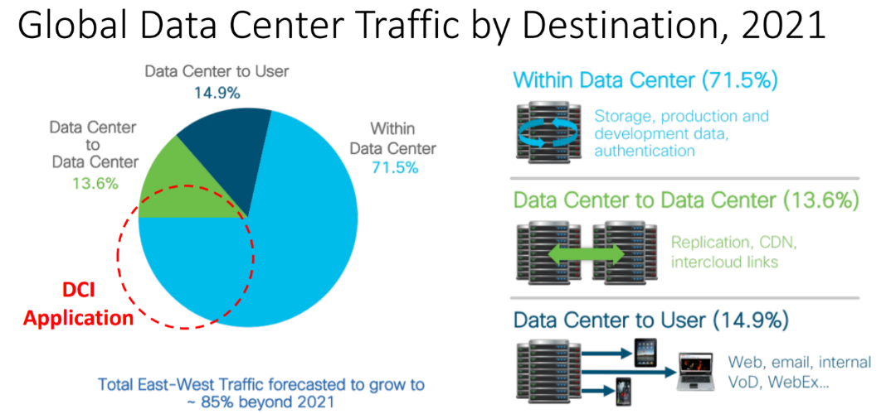
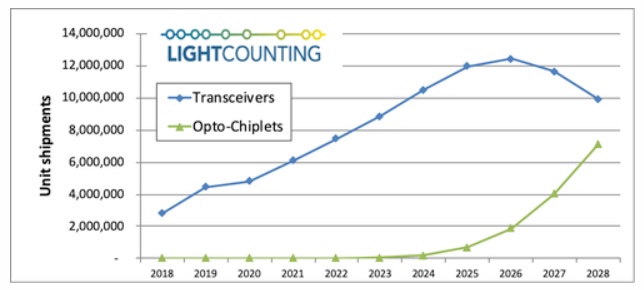

**Кремниевая интегральная фотоника в телекоммуникациях и IT**

[Предисловие](#предисловие)

[Глава 1. Инновационный подход для технологического прорыва](#глава-1-инновационный-подход-для-технологического-прорыва)

[Глава 2. Союз кремния и фотоники](#глава-2-союз-кремния-и-фотоники)

[2.1 Закон Мура больше не работает](#21-закон-мура-больше-не-работает)

[2.2 КИФ как развитие полупроводниковой индустрии](#22-киф-как-развитие-полупроводниковой-индустрии)

[Глава 3. Технологические основы](#глава-3-технологические-основы)

[3.1 Базовые компоненты](#31-базовые-компоненты)

[**3.1.1 Оптические волноводы**](#311-оптические-волноводы)

[**3.1.2 Модуляторы**](#312-модуляторы)

[**3.1.3 Фотодетекторы**](#313-фотодетекторы)

[**3.1.4 Источники света (лазеры)**](#314-источники-света-лазеры)

[3.2 Интеграция и сборка](#32-интеграция-и-сборка)

[**3.2.1 Стыковка с внешними устройствами**](#321-стыковка-с-внешними-устройствами)

[**3.2.3 Интеграция оптических и электрических компонент**](#323-интеграция-оптических-и-электрических-компонент)

[**3.2.4 Термо-стабилизация**](#324-термо-стабилизация)

[Глава 4. Роль КИФ в эволюции высокоскоростной оптики](#глава-4-роль-киф-в-эволюции-высокоскоростной-оптики)

[4.1 Телекоммуникационные сети и сети облачных вычислений](#41-телекоммуникационные-сети-и-сети-облачных-вычислений)

[**4.1.1 Формирование открытого рынка когерентных оптических модулей**](#_Toc64034910)

[**4.1.2 Экономические предпосылки развития КИФ**](#_Toc64034911)

[4.2 Транспорт внутри ЦОД](#42-транспорт-внутри-цод)

[**4.2.1 Архитектура Data Center Fabric**](#_Toc64034913)

[**4.2.2 Объем рынка оптических решений для КИФ**](#_Toc64034914)

[4.3 Передача данных на уровне интегральной платы и кристалла](#43-передача-данных-на-уровне-интегральной-платы-и-кристалла)

[**4.3.1 Экономика коротких расстояний**](#431-экономика-коротких-расстояний)

[**4.3.2 Энергоэффективные решения оптических межсоединений**](#432-энергоэффективные-решения-оптических-межсоединений)

[Глава 5. Оптический ландшафт современных сетей](#глава-5-оптический-ландшафт-современных-сетей)

[5.1 Сети облачных вычислений](#51-сети-облачных-вычислений)

[5.2 Мобильные сети 5G](#52-мобильные-сети-5g)

[Глава 6. Перспективы и возможности для КИФ](#глава-6-перспективы-и-возможности-для-киф)

[6.1 Новые функциональные устройства](#61-новые-функциональные-устройства)

[6.2 Трансформация экосистемы оптической индустрии](#62-трансформация-экосистемы-оптической-индустрии)

[6.3 Расширение образовательных программ](#63-расширение-образовательных-программ)

[Заключение](#заключение)

[Приложение. Возможный план курса повышения квалификации в области КИФ](#приложение--возможный-план-курса-повышения-квалификации-в-области-киф)

[Список литературы](#_Toc64034927)

# **Предисловие**

В 1995 году исследовательская компания Gartner предложила некую модель для прогнозирования и объяснения тенденций, связанных с появлением новых технологий – цикл зрелости технологий (Hype Cycle). Модель показывает насколько перспективной является технология на основании степени интереса к ней со стороны общества и специалистов.

Согласно этой модели, любая технология циклически проходит этапы своей зрелости, от рождения (начало обсуждений в среде специалистов) до коммерческого внедрения (повсеместное обыденное использование). История кремниевой интегральной фотоники (КИФ) полностью вписывается в данную модель.

Период технических дискуссий специалистов последнего десятилетия 20-го века привел к возникновению новых компаний - стартапов и их последующего поглощения со стороны крупных игроков, которые не хотели упустить новые возможности. В свою очередь этот период уступил место затишью, когда индустрия начала лучше осознавать не только достоинства технологии, но и ее проблемы. К настоящему времени этот период закончился. На рынок выходят все больше производителей с продуктами на основе КИФ. Этому способствует и опережающий рост спроса, сложившиеся производственные цепочки и глобализация рынка в целом. Знаком признания этой технологии после периода сомнений можно считать недавнюю покупку компанией Cisco одной из наиболее успешных компаний-пионеров технологии Acacia Communications [1].

Интерес к КИФ растет на фоне важных перемен на рынке телекоммуникаций и IT, связанных с ростом числа поставщиков интернет-контента, развитием технологии облачных вычислений и строительством мобильных сетей 5G. Эти факторы оказывают непосредственное влияние на поставщиков услуг связи и облачных услуг, которые перестраивают свою техническую и закупочную стратегии в соответствии с требованиями рынка.

Другой важный фактор - окончание действия закона Мура и поиск новых технико-экономических закономерностей для роста бизнеса полупроводниковой индустрии.

В свою очередь оптическая промышленность производства систем связи сталкивается со своими проблемами, связанными с исчерпанием пропускной способности волокна. До недавнего времени считалось, что оптическое волокно имеет “почти безграничную пропускную способность” Рост интернет-трафика, использование смартфонов и все большее распространение услуг на основе видео показывают, что это не так.

Каждый из этих перечисленных факторов и проблем имеет самостоятельное значение. Но вместе они показывают необходимость нового мышления в отношении дальнейшей полупроводниковой микроминиатюризации, разработки оптических устройств и систем, а также новых возможностей для развития бизнеса и назревших изменений в отрасли. Это привело к тому, что для КИФ сложились необходимые условия для качественного роста.

Несмотря на это, для индустрии полупроводниковых микросхем в их текущих планах оптика часто по-прежнему остается на заднем плане. И это необходимо изменить. Кремниевой интегральной фотонике еще предстоит решить ряд проблем, однако, можно констатировать, что игнорировать эту технологию невозможно.

Эта книга не является традиционным учебником, в ней нет формул. Это не сборник научных статей ведущих ученых. Это не практическое руководство по проектированию и не анализ исследования рынка. На эти темы есть хорошо написанная литература.

В этой книге мы ставили перед собой более широкую задачу - обобщить существенные изменения, происходящие в индустрии облачных вычислений, телекоммуникационных сетей и полупроводниковых микросхем, которые объясняются открывающимися рыночными возможностями, а также роль, которую может сыграть в этом кремниевая интегральная фотоника. Показать перспективы конвергенции оптической индустрии и полупроводниковой промышленности.

Для достижения этой цели содержание книги расширено за пределы оптической тематики. Книга написана с предположением, что не все читатели знакомы с оптикой или производством полупроводниковых микросхем.

В книге основное внимание уделяется отраслям связи и передачи данных, которые являются и останутся основными рынками для КИФ по крайней мере в течение ближайших 5-10 лет.

Книга затрагивает темы в области сетей оптической связи, их архитектуры, построения сетевых узлов для различного применения. Эти темы раскрыты в той степени детализации, которая необходима для поставленной задачи. Для заинтересованных читателей для более глубокого изучения представлен достаточно подробный список литературы.

Книга ориентирована на специалистов в области телекоммуникаций и IT, которые хотят расширить кругозор для более эффективного решения своих профессиональных задач за счет комплексного понимания инновационных технологий и происходящих в индустрии изменений - разработчиков оптических и оптоэлектронных компонентов и устройств, специалистов по проектированию сетей, руководителей продаж и маркетинга, менеджеров по связям с прессой, руководителей СМИ, работающих в данной сфере, студентов вузов и колледжей.

К настоящему времени большая часть чисто технических проблем технологии КИФ уже решена и на первое место выходит повышение осведомленности и ее доступности для профессионального сообщества. Книга может быть полезна при подготовке соответствующих программ повышения квалификации и переподготовки специалистов.

# **Глава 1. Инновационный подход для технологического прорыва**

Появление электронных транзисторов привело к массовому распространению компьютеров, а развитие оптических технологий в свою очередь способствовало экспоненциальному росту обмена трафика между ними, появлению глобальной сети Интернет и возникновению индустрии облачных вычислений. Предполагается, что одним из очередных масштабных шагов инфраструктурного развития на пути к цифровой экономике станет достижение синергетического эффекта при применении оптических технологий для решения задач в области электроники и наоборот. Этот новый подкрепляется инновационной технологией называемой кремниевой интегральной фотоникой - КИФ.

С точки зрения компонентной базы КИФ является одним из новых подходов, которые могут быть использованы для изготовления оптических устройств. Однако, возможности КИФ гораздо шире. КИФ позволяет изготавливать и производить сборку оптических устройств на кремниевой подложке с использованием широко применяемого в электронной промышленности набора полупроводниковых КМОП технологий (комплементарная структура металл-оксид-полупроводник; англ. CMOS, complementary metal-oxide-semiconductor) построения интегральных микросхем.

На современном этапе развития бизнеса телекоммуникационные операторы столкнулись с опережающим ростом трафика в сети по отношению к увеличению своих доходов, а также исчерпанием пропускной способности транспортной оптической инфраструктуры за счет быстрого развития облачных вычислений и трафика широкополосного доступа. Разрешить эти проблемы должна оптическая индустрия. Однако потребность в ее инновационном развитии обусловлена не только необходимостью решения текущих задач

Технический прогресс последнего столетия стал возможен во многом благодаря изобретению электронной интегральной схемы (ЭИС) и ее дальнейшему развитию. К настоящему времени экстенсивное развитие микроэлектроники, как и дискретной оптической техники исчерпало свой потенциал и перед индустрией встала задача осуществления технологического прорыва.

В полупроводниковом производстве применяются пластины кремния на диэлектрике, которые разработаны для быстродействующих электронных схем. Для КИФ это означает возможность проектирования с использованием диэлектрического слоя планарных оптических волноводов, которые являются основными строительными блоками фотонной интегральной схемы (ФИС). На рисунке 1 схематично представлены структура оптоволоконного кабеля и планарного оптического волновода.

Рисунок 1. Структура оптоволоконного кабеля (а) и планарного оптического волновода

Что касается других оптических и оптоэлектронных устройств, то технологические процессы производства имеют свои особенности, которые могут отличаются от технологических процессов изготовления электронных микросхем.

Так как кремний не является оптимальным материалом для генерации света, то для обеспечения кремниевой фотонной интегральной схемы (КФИС) источниками света используются другие материалы, такие как арсенид галия, фосфид индия и т.д., известные в периодической таблице как соединения III-V.

То же самое касается детектирования светового потока, т.е. преобразования фотонов в электрический ток. Одним из лучших материалов для фотоприемника является германий. При этом практика добавления в кремний других материалов (в том числе германия) давно используется для расширения области применения и повышения эффективности КМОП технологий в электронной промышленности.

Изготовление ЭИС является одним из наиболее развитых в мире процессов крупносерийного и массового производства, который непрерывно совершенствовался на протяжении десятка леи и в который были сделаны большие финансовые инвестиции. Ключевой фактор, который выделяет КИФ среди других альтернативных технологий изготовления оптических устройств, это возможность использования наработок и производственных мощностей много более масштабной экосистемы полупроводниковой промышленности, а именно

-   Использование наработанного опыта прецизионного производства чипов для улучшение оптических характеристик, а также минимизация процента брака по отношению, например, к производству на основе фосфида индия.

    В частности, кардинальное снижение процента брака позволило сделать качественный шаг в развитии оптической индустрии, т.е. широком внедрении интегральных устройств с большим числом оптических элементов, в том числе оптических систем когерентного приема.

-   Использование кремниевых пластин гораздо большего размера и, соответственно, возможность одновременного изготовления на пластине большого количества ФИС. Это позволяет снизить стоимость производства по сравнению с конкурирующими технологиями (производство на базе материалов группы III-V требует использования значительно более дорогих пластин гораздо меньшего диаметра)
-   Законченность и оптимизацию всех циклов производства включая не только обработку пластин для создания фотонных схем, но также технологии и оборудование для резки, сборки и тестирования
-   Развитый инструментарий проектирования и т.д.

Как результат появляется возможность кардинального снижения себестоимости производства и повышение потребительских свойств оптической техники.

Еще одна особенность КИФ состоит в том, что, в отличие от производства ЭИС, она использует гораздо большие размеры элементов. Минимальный размер оптического волновода определяется длиной волны. Поскольку свет находится в инфракрасной части электромагнитного спектра, то его длина волны больше, и для изготовления оптических элементов достаточно использования технологических процессов с меньшим разрешением (250, 130, 90, 65 нм). Тем самым существующее оборудование для производства КМОП получает новую жизнь, а используемые технологические процессы и материалы (шаблоны, фоторезистивные материалы и т.д.) имеют меньшие затраты и стоимость.

Кремний позволяет не только реализовать оптические пассивные устройства (волноводы, модуляторы и т.д.) и использовать другие материалы (например, германий для фотодетектирования), но также выступает как платформа интеграции в кремний для оптических компонент на основе материалов III-V, используемых в составе интегрального устройства. Такое комбинирование кремния, III-V и других материалов позволяет максимально использовать сильные стороны каждого. На рисунке 2 представлен пример использования кремния в качестве оптической интегральной платформы.

Рисунок 2. Пример использования кремния в качестве оптической интегральной платформы [2]

В главе 2 поясняется в чем состоит проблема дальнейшего экстенсивное развития микроэлектроники, как она может быть решена, какие свойства кремния сделали этот материал основным для перспективного развития интегральной техники, кратко изложена история развития данного технологического направления и пояснено, как КИФ встраивается в существующую экосистему полупроводниковой индустрии и какие перспективные задачи должна решить индустрия.

Нанесение оптических компонент на кремниевую пластину представляет собой только часть технологического процесса КИФ. Поскольку как отмечено выше кремний не может генерировать и детектировать световой поток, то разработка оптических компонентов и их интеграция на кристалле ведется в рамках монолитной или гибридной интеграции с использованием других материалов. При этом интеграция и сборка КФИС значительно сложнее аналогичного процесса для ЭИС. Практика показывает, что если в производстве электронных микросхем около 80% всех затрат приходится на изготовление кремниевой пластины с нанесенными компонентами, то в производстве оптических интегральных схем 80% всех затрат приходится на тестирование, интеграцию и сборку.

Технологические основы КИФ раскрываются в главе 3. Глава содержит обзор базовых компонентов элементной базы, особенности интеграции и сборки, в том числе стыковку кристалла с внешними устройствами, интеграцию оптических и электрических компонент и обеспечение термо-стабилизации.

Телекоммуникации и облачные вычисления образуют сложную коммуникационную среду, в которой можно выделить несколько доменов, и которые определяются своим диапазоном расстояний и характеризуются разными условиями применения:

-   Телекоммуникационные сети и сети облачных вычислений (от нескольких тысяч до десятков километров)
-   Транспорт в узлах ЦОД (от нескольких километров до метров)
-   Транспорт внутри платы, кристалла (меньше метра)

Представленные домены в свою очередь могут быть также сегментированы с учетом специфики бизнеса. Например, для традиционной бизнес модели телеком индустрии основные требования к телекоммуникационной сети связаны с повышением спектральной эффективности и пропускной способности оптического волокна. В тоже время потребительская ценность оптических решений для IT индустрии во многом определяется технико-экономическими метриками, т.е. занимаемой площадью, объемом, энергопотреблением и себестоимостью. В главе 4 рассмотрены перспективы КИФ для реализации оптических решений в указанных доменах коммуникационной среды.

Понятно, что по производственному потенциалу с КИФ не может сравниться ни одна из альтернативных технологий. Тем не менее, существует ряд проблем, которые в освоении КИФ должна решить оптическая индустрия.

Один из важнейших вопросов - обеспечение больших объемов производства, как ключевого фактора экономической эффективности. Например, в период первых коммерческих успехов КИФ, когда Acacia Communications объявила о продаже за двухлетний период (2015-2016) 13000 когерентных оптических трансиверов, изготовленных по технологии КИФ [3], в мире только в 2015 году было продано 276 миллионов ноутбуков [4] и около 1,4 миллиарда смартфонов [5]. При этом объем кремниевых пластин, изготовленных для оптических трансиверов, составлял всего несколько сотен в год. Понятно, что такой дисбаланс в объемах ограничивает интерес в КИФ со стороны предприятий полупроводниковой промышленности.

Поэтому первоначальный фокус внедрения КИФ направлен на самый массовый продукт – оптические модули, используемые в телекоммуникационной и IT индустрии, где последняя играет ключевую роль в определении вектора развития.

Показано, что сверхзадача IT индустрии при увеличении скоростей до 400Гбит/сек, которая состоит в необходимости остаться в рамках существующих габаритов, энергопотребления и минимизации стоимости, дает уникальную возможность для КИФ стать доминирующей универсальной технологией повсеместного применения в оптической индустрии и реализовать возложенные на нее ожидания.

Помимо количественного развития в части увеличения доли среди конкурирующих технологий и увеличения абсолютного объема продукции для традиционного применения технология КИФ позволяет расширить применение оптических решений заменяя электрические на коротких расстояниях (шасси, плата, кристалл). Это становится возможным за счет использования уникальных преимуществ КИФ в оптоэлектронной интеграции.

В главе 5 рассматривается применение решений на основе КИФ в современных сетях ведущих провайдеров услуг облачных вычислений и мобильных сетях 5G.

Основной движущей силой развития транспортной сети центров обработки данных (ЦОД) является опережающий рост внутрисетевого трафика. Построение современных оптических сетей ЦОД опирается на так называемую концепцию Data Center Fabric (DCF), которая представляет собой единую высокопроизводительную, легко масштабируемую транспортную сеть с возможностью эволюции на более высокие скорости, которая характеризуется максимально плоской архитектурой. Недостаточный прогресс оптической индустрии является одним из основных сдерживающих факторов ее развития.

В настоящий момент ресурс 100Гбит/с технологий исчерпан и существующая инфраструктура оптимизирована для перехода на 400Гбит/с решения. На первый план выходит снижение энергопотребления на уровне устройств ввода/вывода электрических микросхем. Решение этой задачи напрямую связано с уникальным преимуществом технологии КИФ в проектировании и производстве оптоэлектронных схем и заменой электрических устройств ввода/вывода оптическими. Ожидаемая экономия энергопотребления за счет их внедрения при переходе на 400Гбит/с составляет по оценкам компании Facebook около 30-50%.

Дополнительным фактором, поддерживающим проникновение технологии КИФ на все более короткие расстояния, а, следовательно, все большие объемы производства является высокая экономическая эффективность применения одномодового волокна по сравнению с многомодовым.

Показано, что при внедрении компонентной базы 400Гбит/с в сети облачных вычислений использование оптических решений на основе технологии КИФ позволит перекрыть весь диапазон возможных расстояний.

Сеть 5G является завершающим этапом с точки зрения конвергенции телекоммуникационной и IT индустрии, т.е. предполагает реализацию в виртуальной среде (в ЦОДах) всех сетевых функций и сервисных приложений включая радиодоступ.

Требования к транспорту в домене опорных сетей и агрегации (Backhaul) мобильной сети близки к характеристикам межЦОДовых транспортных каналов т.н. “региональных доменов” в силу миграции узлов мобильной сети в облачную среду вычислений. Поэтому сети 5G являются целевой областью применения оптических систем, разработанных для IT индустрии. Тем самым увеличивается общий объем рынка и, соответственно, повышается эффективность использования технологии КИФ.

Что касается специфики транспортной сети применительно к 5G, то она проявляется в сегменте радиодоступа в диапазоне используемых расстояний (до 20км) при требуемых скоростях 10-300Гбит/с. Эти требования лежат на стыке систем когерентного приема и прямого детектирования.

Уже сейчас индустрией предлагаются когерентные модули на основе технологии КИФ, адаптированные с точки зрения скоростей и расстояний для верхней границы требований 5G RAN (100-200Гбит/с для расстояний от 10км).

Решения прямого детектирования могут занять нишу более коротких расстояний и скоростей вплоть до 50Гбит/с. Перспективы появления таких оптических решений на основе технологии КИФ будут определяться объемом потребностей мобильной индустрии при дальнейшем развитии сетей 5G.

В предыдущих главах рассматривается текущее развитие КИФ. Глава 6 посвящена перспективным возможностям КИФ в части предложения принципиально новых функциональных устройств и трансформации экосистемы оптической индустрии вследствие широкомасштабного применения КИФ.

Технологические достижения, достигнутые к настоящему времени в разработке высокоскоростных кремниевых оптических приемопередатчиков, стимулируют исследования новых функциональных устройств на базе технологии КИФ. В частности прогресс в замещении электрического способа передачи оптическим для соединений между электронными микросхемами позволил индустрии обратить внимание на разработку высоко-интегрированных оптических коммутационных устройств для применения в качестве реконфигурируемых устройств ввода/вывода в городских транспортных сетях и матриц оптической коммутации для оптического транспорта ЦОД. В главе 6 рассматривается техническая реализуемость и готовность к производству подобных устройств на примере проекта IRIS [6].

С точки зрения объема рынка ближайшие перспективы развития технологии КИФ будут по-прежнему связаны с телекоммуникационной индустрией и IT. Показано, какое влияние технология КИФ оказывает на современную организацию оптической отрасли и ее место в будущем полупроводниковой промышленности.

*Выводы:*

*Технология КИФ объединяет два индустриальных сегмента – микроэлектронику и оптику. Она дает возможность для телекоммуникационной и IT инфраструктуре соответствовать растущим требованиям в части дальнейшей миниатюризации, повышения производительности, снижения себестоимости и энергопотребления в различных сферах применения начиная от магистральных сетей и заканчивая проектированием сложных функциональных устройств на кристалле.*

*Применение КИФ позволяет изготавливать и производить сборку оптических устройств на кремниевой подложке на основе КМОП технологий, используя уже сделанные инвестиции, производственные мощности, технологические процессы и материалы*

*По отношению к альтернативным технологиям КИФ является универсальной и открывает возможности проектирования различных решений, которые перекрывают весь диапазон расстояний передачи и преобразования сигнала (от тысяч километров до микрометров)*

*В настоящий момент складываются условия для повсеместного перехода на КИФ, в том числе за счет достижения определенного критического объема производства, необходимого с точки зрения экономической конкурентоспособности.*

# **Глава 2. Союз кремния и фотоники**

## **2.1 Закон Мура больше не работает**

В 1965 году в журнале Electronics была опубликована статья, посвященная перспективам и экономической целесообразности увеличения числа элементов на кристалле [7]. Автором статьи был директор по R&D компании Fairchild Semiconductor Гордон Мур.

В то время диаметр кремниевой пластины был 25мм, на которой размещалось всего 50 компонентов. Мур заметил, что для определенного уровня развития технологий есть некоторое число компонентов, которые могут быть включены в микросхему для достижения минимальной себестоимости. Дальнейшее увеличение их числа приводит к неоправданному увеличению сложности, проценту брака и соответственно росту затрат.

Сделанные в статье предположения позволили сформулировать гипотезу, что оптимальное число элементов удваивается через фиксированные промежутки времени. Эта гипотеза и легла в основу так называемого закона Мура и несмотря на то, что за время, прошедшее с момента публикации, величина этого фиксированного промежутка времени менялась, этот закон был главным принципом развития бизнеса полупроводниковой промышленности.

Однако, уменьшение размеров транзистора (базового элемента ЭИС) не могло продолжаться бесконечно, тем более в настоящий момент размеры транзисторов уже приближаются к атомарному масштабу. Сейчас коммерчески доступны процессоры, разработанные с использованием 7нм технологии, что соответствует толщине слоя примерно 30 атомов. Разработчики вплотную подступают к техническому пределу дальнейшего совершенствования технологического процесса, в то время как уменьшение стоимости транзистора остановилось уже на 28нм технологии (см. рисунок 3)

Рисунок 3. Зависимость себестоимости транзистора от технологии производства [8]

Иными словами, уменьшение размеров обычных кремниевых транзисторов подошло к физическому пределу, для преодоления которого необходимо не просто оптимизировать работу устройства, а создать новые способы передачи электронов.

Главная проблема состоит в том, что если раньше, уменьшая размер транзистора, можно было одновременно снижать стоимость вычислительных процессоров и повышать их производительность, то дальнейшее уменьшение размера транзистора приводит к росту потребляемой мощности. В настоящий момент невозможно одновременно уменьшать размеры транзистора и увеличивать тактовую частоту их переключения.

Основной путь, по которому идет индустрия, это распараллеливание вычислений путем создания многоядерных процессоров, что приводит к росту сложности разработки, увеличению скорости обмена как внутри кристалла, так и с внешними устройствами, а, следовательно, и дополнительному потреблению мощности.

Возрастающая роль фотоники состоит в том, она может предложить решения по снижению потребляемой мощности и уровню концентрации рассеиваемой мощности, а также обеспечить более высокую пропускную способность и расстояния передачи по сравнению с передачей электрического сигнала.

## **2.2 КИФ как развитие полупроводниковой индустрии**

Традиционными для многих областей применения в оптической индустрии являются материалы, освоение которых началось в 1980-х годах. Их преимущества определялись свойствами, которые необходимы для генерации светового потока, его усиления, детектирования или модуляции. Например, для последнего преимущества определяются высокой чувствительностью его показателя преломления к воздействию электрического поля.

Исходя из этих критериев фосфид индия стал де-факто основным продуктом оптической промышленности как предпочтительная платформа для монолитных фотонных микросхем благодаря способности реализовать основные оптические функции. Однако, на сегодняшний день ни один материал или технология не способны реализовать весь спектр требуемых фотонных устройств и объединить их в одной схеме. Технологии на базе фосфида индия являются основным конкурентом для КИФ, которой необходимо не просто достичь сравнимого уровня зрелости, но и решить при этом гораздо более масштабную задачу оптоэлектронной интеграции на базе единой технологической платформы.

Исследование возможной применимости кремния для фотонных схем началось в середине 1980-х годов. Прогресс сдерживался тем фактом, что что кремний с одной стороны в отличие от фосфида индия и арсенида галлия не излучает, а с другой в отличие от ниобата лития не проявляет того же линейного электрооптического эффекта для возможного его использования в качестве модулятора.

Так что же делает кремний наиболее предпочтительным материалом для перспективного развития интегральной оптической техники?

Оптические свойства кремния можно описать через его характеристики поглощения и преломления в соответствующем спектральном диапазоне.

Так поглощающие свойства материала важны для изготовления фотодетекторов, которые преобразуют входной световой поток в выходной электрический. Важными характеристиками фотоприемников являются чувствительность (коэффициент преобразования мощности оптического сигнала в силу электрического тока), зависимость этой чувствительности от длины волны, быстродействие (ширина полосы) и уровень шума.

Эффективность преобразования оптической мощности в электрический ток зависит от уровня поглощения оптического сигнала в материале. Как видно из рисунка 4 кристаллический кремний поглощает свет до длины волны около 1100 нм.

Рисунок 4. Характеристики поглощения оптического излучения различными материалами

Благодаря этому свойству кремний может использоваться при изготовлении фотоприемников оптических систем, работающих от видимого до ближнего инфракрасного диапазона, в то время как рабочий диапазон телекоммуникационных и IT оптических сетей находится в диапазоне 1300…1600 нм.

Для длин волн выше 1100 нм кремний становится прозрачным. Способность пропускать свет является важным свойством кремния, как материала платформы ФИС для использования в рабочем диапазоне оптических телекоммуникационных сетей и IT.

Другим важным параметром для передачи светового потока является показатель преломления. На рисунке 5 показан показатель преломления кремния для диапазона длин волн 1100–1700 нм.

Рисунок 5. Показатель преломления кремния в зависимости от длины волны

С точки зрения передачи света оптоволокно и любая оптическая среда характеризуется числом лучей света, которые эта среда способна проводить одновременно. Это число называется оптическая мода.

Каждая мода (луч) распространяется со своей скоростью. В оптических телекоммуникационных сетях и большом числе IT применений предполагается передача сигнала на такие расстояния, при которых использование нескольких мод приводит к разрушению формы сигнала на приемной стороне. Поэтому для таких применений используются одномодовые среды.

В одномодовых волноводах чем больше разница показателей преломления между сердцевиной и оболочкой, тем меньше могут быть размеры сердцевины. Показатель преломления кремния примерно равен 3,5, в то время как аналогичное значение для диоксида кремния составляет около 1,45. Большая разница в индексах материалов кремниевой пластины позволяет создавать компактные оптические устройства. Для сравнения в таблице 1 представлена контрастность показателей преломления и размеры волноводов некоторых материалов.

Таким образом, высокая степень интеграции оптических устройств для одномодовой передачи достигаемая благодаря большой разнице в коэффициентах контрастности материалов кремниевой пластины делает кремний оптимальной платформой ФИС для телекоммуникационных сетей и IT.

Основной интерес и прогресс в разработке КИФ связан с изменением подхода “от частного к общему” на “от общего к частному”, соответствующий потенциалу и масштабу задачи. При этом подходе было предложено использования кремния как платформы для производства “супер-микросхемы”, т.е. такой оптоэлектронной интегральной схемы, которая будет сочетать в себе оптические и электрические функциональности. Ее концепция иллюстрируется на рисунке 6.

Таблица 1

Рисунок 6. Концепция оптоэлектронного чипа на основе кремниевой платформы [9]

Помимо полного набора оптических элементов (волноводов, модуляторов, фотоприемников, делителей, усилителей и т.д.) “супер-микросхема” включает в себя и электрические схемы на базе широкого набора специализированных транзисторов. В качестве таких транзисторов на рисунке представлены транзисторы, которые могут быть использованы, например, для усиления радиосигнала в разных частотных диапазонах (HBT, HEMT), цифровой обработки на микропроцессорах (BiCMOS). Согласно используемой элементной базе представленная такой оптоэлектронный чип мог бы быть использован, например, для построения микро-базовых станций мобильной сети.

О кремниевой интегральной фотоники впервые задумались в середине 1980-х годов, однако, первые осязаемые успехи пришли к технологии в начале 2000-х годов. С тех пор технология прошла весь цикл достижения своей зрелости, который сопровождался рядом ключевых разработок, что иллюстрируется на рисунке 7.

Рисунок 7. Цикл зрелости технологии и ключевые разработки КИФ

Одно из первых значимых успехов развития КИФ связано как раз с появлением решения подключения будущей КФИС к внешним устройствам. В 2002-2003 годах была разработана конструкция решения “обратный конус” по согласованию светового потока между оптоволокном и гораздо меньшим по размеру кремниевым оптическим волноводом [10], [11]. Эти решения обсуждаются в главе 3.

Период 2003-2008 года был связан с разработкой и улучшением технических характеристик элементной базы лазеров, модуляторов, фотодетекторов и т.д. для разработки первых коммерческих оптических продуктов на базе КИФ – оптических трансиверов (модулей). Появились первые стартапы – компании, ориентированные на создание новых, инновационных продуктов на основе КИФ:

-   Kortura впервые предложила регулируемый оптический аттенюатор (2005 год)
-   Lightwire разработала 10Гбит/с оптический модуль Ethernet (2008 год)
-   Luxtera разработала активный оптический кабель (AOC – active optical cable) для соединения оборудования внутри серверной стойки узла ЦОД (2008 год)

Примерно в 2013 году объем инвестиций и успехи развития обратили на КИФ серьезное внимание со стороны оптической индустрии.

Технология начала оказывать влияние на развитие архитектурных решений. Например, концепция “дезагрегированного сервера”, провозглашенная компаниями Intel и Facebook [12], своим появлением во многом обязана тому потенциалу оптического транспорта, который был раскрыт с помощью кремниевой интегральной фотоники. Основная идея этой концепции состоит в том, чтобы разделить “монолитную архитектуру” сервера выделив из нее процессорные ресурсы, память и устройства хранения данных в отдельные съемные блоки. Это позволило получить гибкие конфигурации для повышения кпд аппаратных ресурсов ЦОД, лучшее масштабирование функций и лучшие возможности плавной модернизации. Очевидно, такой подход требовал специального решения оптического транспорта (максимальная компактность, низкое энергопотребление, широкая полоса, низкая стоимость при большом объеме производства).

Последующий период был связан с образованием устойчивых производственных цепочек, появлением новых производителей, расширением продуктовой линейки кремниевой фотоники. В частотности появились съемные 100Гбит/с оптические модули в форм-факторе QSFP28 (CWDM4/CLR4 - до 2км, PSM4 - до 500м), модуль прямого детектирования для скорости 200Гбит/с в форм-факторе CFP2 (до 130км), когерентные модули для скоростей 100/200/300/400Гбит/с.

Схематично современная экосистема КИФ показана на рисунке 8, которая состоит из поставщиков материалов, компаний, предоставляющих услуги проектирования КФИС, обработки кремниевых пластин, предприятий, занимающихся сборкой и упаковкой микросхем, компаний-разработчиков устройств и систем, а также потребителей, в первую очередь крупных провайдеров облачных услуг и владельцев крупных ЦОДов.

Рисунок 8. Современная экосистема КИФ

Тем не менее, до настоящего времени КИФ еще не достигла переломного момента, т.е. перехода от решения узкоспециализированных задач к повсеместному применению. Можно сказать, что развитие технологии выходит на финишную прямую.

Технологии КИФ еще предстоит окончательно преодолеть ряд препятствий, одним из важнейших которых является традиционная для инновационных технологий дилемма “курицы и яйца”. С одной стороны предприятия полупроводниковой промышленности будут заинтересованы в освоении производства КФИС, когда появятся большие объемы, а для больших объемов необходимо множество заказчиков – производителей и разработчиков микросхем и устройств на их основе.

В полупроводниковой электронной промышленности широкое распространение получило изготовление кремниевых пластин, на которых одновременно размещаются топологии микросхем, разработанные разными организациями. Такое стало возможным за счет использования единой библиотеки компонентов и инструментов проектирования. Подход позволяет снижать начальные инвестиции, поскольку появляется возможность покупать определенную площадь на пластине, а не всю пластину целиком.

Кремниевая интегральная фотоника только в начале этого пути, но тем не менее наряду с услугами по производству предприятия начинают предлагать библиотеку различных компонентов, позволяя проектировщикам сосредоточиться на архитектуре высокого уровня или разработке специальных компонент, одновременно используя элементы существующей библиотеки для проектирования законченного решения. Пример оптических элементов из такой библиотеки для проектирования интегральных схем приведен на рисунке 9. Элементная база для оптической схемотехники на кремнии рассматривается в главе 3.

Рисунок 9. Пример библиотеки оптических элементов

*Выводы:*

*Уменьшение размера транзистора больше не дает того эффекта, использование которого в течение долгого времени позволяло извлекать выгоду в части снижения себестоимости производства и роста производительности. Закон Мура перестает работать.*

*Ожидается, что комбинация нескольких технологии станет преобладающим подходом к решению проблемы. Интегральная интегральная фотоника будет одной из таких технологий, возможно, ключевой.*

*Прозрачность в рабочем спектральном диапазоне и наибольшая компактность при интеграции для одномодового режима выделяют кремний как основной материал платформы оптических интегральных схем для сетей телекоммуникаций и IT. Тем самым кремниевая интегральная фотоника предлагает элегантный подход к конвергенции электрического и оптического способа обработки информации*

*В настоящее время продукция кремниевой интегральной фотоники представлена на рынке, в индустрии сформировалась экосистема и налажены устойчивые производственные цепочки, адаптированы технологические процессы проектирования за счет расширения библиотеки электронных компонентов оптическими. Снижены барьеры начальных инвестиций для новых производителей за счет возможности совместного использования площади кремниевой пластины при производстве*

*Тем не менее, кремниевая интегральная фотоника еще не достигла переломного момента перехода от решения узкоспециализированных задач к повсеместному применению. Ключевыми задачами отрасли является увеличение объемов производства КФИС в промышленном масштабе, дальнейшая унификация компонентной базы и расширение сфер применения.*

*Технические и производственные проблемы, с которыми сталкивается развитие КИФ являются инженерными проблемами, решение которых вопрос времени, инвестиций и системной работы. Ожидается, что переломный момент наступил в период 2021-2023.*

# **Глава 3. Технологические основы**

Поскольку кремний не является оптимальным материалом для генерации и детектирования светового потока, то для интеграции оптических элементов, состоящих из разных материалов, можно выделить два подхода:

-   монолитная интеграция
-   гибридная интеграция.

При монолитной интеграции все оптические функции реализованы с использованием одного и того же типа материалов, таких как фосфид индия, арсенид галлия или материалы на основе кремния. Это могут быть КФИС, например, реализующие передающий тракт с внешней модуляцией оптического излучения. В этом случае решение состоит из интеграции лазера и модулятора. В частности, такие монолитные КФИС могут быть оптоэлектронными, т.е. сочетать в себе, например, оптический модулятор с электронной схемой драйвера модулятора.

Гибридная интеграция включает создание интегральной схемы с использованием двух и более материалов. Преимущество гибридного подхода заключается в том, что для каждой функции может быть использован лучший материал. Но при этом разные материалы нужно комбинировать, что является важной особенностью при проектировании и производстве.

Монолитный кристалл КИФ может сочетать в себе все необходимые оптические функции за исключением лазера. Если необходим лазер, то конструкция может быть только гибридной.

В отдельную подгруппу можно выделить так называемую гетерогенную интеграцию, в которой разные материалы используются в едином технологическом процессе изготовления. Гетерогенная интеграция возможна и в рамках гибридной интеграции, когда, например, лазер прикрепляется к кремниевой пластине во время изготовления (т.н. методы “крепления”), и в рамках монолитной интеграции, когда какой-либо компонент из другого материала выращивается непосредственно на кремниевой пластине (т.н. методы “эпитаксии”). Гетерогенная интеграция позволяет создавать устройства, по своим свойствам близкие к монолитной схеме с одновременным использованием нескольких материалов.

Сборка на кремнии позволяет интегрировать функции, которые не были широко интегрированы с использованием какой-либо другой платформы. Это могут быть не только лазеры, но и другие оптические устройства (модуляторы, фотодетекторы, оптические изоляторы, циркуляторы и т.д.). Также появляется возможность создания сложных оптических систем в сочетании с электроникой.

Соотношение монолитной, гибридной и гетерогенной интеграции при использовании кремниевой фотоники схематично показано на рисунке 10.

Рисунок 10. Подходы к проектированию кремниевых фотонных чипов

## **3.1 Базовые компоненты**

На рисунке 11 схематично представлена оптическая система, которая является основой оптических приемопередатчиков - первых продуктов КИФ, которые появились на коммерческом рынке телекоммуникационных сетей и IT.

Рисунок 11. Оптическая система приемопередатчиков оптического сигнала

При оптической передаче данных между двумя точками необходимы 3 типа оптических компонент: источник света (лазер), модулятор, фотодетектор. Эти компоненты наряду с оптическими волноводами, которые используются для направления света между различными оптическими компонентами, являются в настоящий момент базовыми блоками КФИС.

### **3.1.1 Оптические волноводы**

Комбинация минимальных кристаллических дефектов с сильным ограничением мод из-за высокого контраста показателей преломления между кремнием и диоксидом кремния (около 3,47 и 1,44 соответственно [13]) является оптимальным решением для оптических волноводов. Это позволяет обеспечить низкие потери передачи оптического потока (менее 1дБ/см [14], [15], [16] плоть до 0.3дБ/см, [17]) и малый радиус изгиба (до 1.5 мкм, [18]) гарантируя высокий потенциал микроминиатюризации и плотности размещения на кристалле.

Схематично оптический планарный волновод, выполненный по технологии “кремний на изоляторе” представлен на рисунке 12.

Рисунок 12. Оптический планарный волновод, выполненный по технологии “кремний на изоляторе”

Типовые размеры волновода – несколько сотен нанометров в ширину и в высоту. Существует компромисс между плотностью размещения волноводов на кристалле и потерями в них. Волноводы с размером более микрона имеют меньшие потери, но это уменьшает число элементов на кристалле. Субмикронные волноводы, напротив, увеличивают плотность устройства, но имеют более высокие потери.

Шероховатость боковых стенок волновода также вносит свой вклад в потери сигнала за счет рассеивания света. Сглаживанием боковых стенок или созданием геометрии волновода, при которой сила света на боковых стенках уменьшается, можно снижать уровень потерь.

К настоящему времени применяется несколько типов волноводных структур, каждая из которых нацелена на разные применения имея при этом определенные преимущества и недостатки. На рисунке 13 схематически показаны четыре наиболее часто используемых геометрии волновода.

Рисунок 13. Схематическое изображение наиболее часто используемых в КИФ геометрий волноводов: (а) полоска (канал), (b) ребро, (c) щель, (d) суб-волна

Ниже приводится краткое описание основных характеристик этих волноводов:

-   Волноводы типа “полоска” позволяют получить высокий индекс контраста в обоих вертикальном и горизонтальном направлениях и радиус изгиба менее 5 мкм, что делает их оптимальными для реализации сверхкомпактных устройств.

    Недостатком является высокая чувствительность к шероховатости боковин, что приводит к сравнительно высоким потерям передачи сигнала

-   Волноводы типа “ребро” позволяют уменьшить контрастность на боковых стенках и тем самым снизить потери распространения. Конструкция этого типа волновода хорошо подходит для построения модуляторов и фотоприемников
-   Волноводы типа “щель” наиболее чувствительны к шерховатости боковых поверхностей, но оптимальны для гибридной интеграции активных материалов на кремниевую пластину
-   Волноводы типа “суб-волна” представляют собой периодическую структуру с шагом меньше половины длины волны. Они имеют потери сравнимые с потерями в обычных полосковых волноводах и позволяют реализовать переходы с низкими потерями и высокоэффективные соединители волокно-кристалл.

Оптические волноводы используются и как составная часть более сложных элементов – резонаторов, мультиплексоров, делителей мощности, направленных ответвителей, интерферометров и т.д.

### **3.1.2 Модуляторы**

При использовании внешней модуляции модулятор находится непосредственно перед лазером и изменяет параметры светового потока (амплитуду, фазу, частоту) за счет изменения оптических свойств под воздействием электрического поля информационного сигнала.

Внешний электрический сигнал изменяет действительную и/или мнимую части коэффициента преломления рабочего материала. Действительная часть коэффициента связана с фазовой скоростью, а мнимая часть с поглощением. Это позволяет разделить оптические модуляторы на модуляторы электро-рефрации и модуляторы электро-абсорбции.

В КИФ наиболее распространены два механизма изменения коэффициента преломления. Это термо-оптический эффект и эффект дисперсии плазмы.

Высокий термо-оптический коэффициент кремния позволяет создавать резистивные нагреватели из металлических слоев или легированного кремния для настройки коэффициента преломления. Однако, скорость изменения теплового режима слишком мала для использования в модуляторах телекомуникационных и IT сетей. Основное применение термо-оптического эффекта в настоящее время это компенсация теплового дрейфа или перестройка рабочего спектрального канала.

Эффект дисперсии плазмы позволяет обеспечить более высокие скорости. Он заключается в изменении комплексного показателя преломления при изменении концентрации свободных носителей (электронов и дырок) в полупроводнике. Поскольку изменение мнимой части показателя преломления не велико, то эффект дисперсии плазмы используется в модуляторах электро-рефракции с полосой пропускания до 50ГГц. Наиболее распространенными модуляторами, основанными на эффекте дисперсии плазмы, являются модуляторы на основе интерферометра Маха-Цендера и кольцевых резонаторов.

Интерферометры - это устройства, основанные на явлении интерференции волн, они конфигурируются разными способами и используются в большом количестве приложений оптики и фотоники.

Интерферометр Маха-Цендера использует один источник света, разделенный на две волны, которые проходят по разным путям, а затем снова собираются вместе и создают помехи. В зависимости от накопленной разности путей между двумя волнами результирующая оптическая мощность может варьироваться от нуля (деструктивная интерференция) до максимальной мощности (конструктивная интерференция).

В устройствах, изготовленных по технологии КИФ интерферометры состоят из двух элементов разделения/суммирования мощности, соединенных двумя плечами интерферометра. Для разделения и объединения мощности можно использовать, например, направленные ответвители на 3 дБ, как показано на рисунке 14а.

Рисунок 14. Интерферометр на основе Маха-Цендера (a) и выходные мощности портов A и B, выраженные в дБ, в зависимости от разности фаз между плечами интерферометра (б)

Два плеча интерферометра имеют разную длину оптического пути (на рисунке верхнее плечо является опорным). Поэтому волны, распространяющиеся в двух плечах, накапливают разность фаз Φ. Две волны интерферируют в сумматоре и, в зависимости от того, насколько велика Φ, создают различную выходную мощность в выходных волноводах A и B. На рис. 14б показан график зависимости выходных мощностей волноводов А и B от Φ.

Кольцевой резонатор - устройство типа фильтра, которое выполняет операции в зависимости от длины волны входящей световой волны. Резонаторы, как правило, колеблются с большой амплитудой на определенных частотах, называемых резонансными частотами. Чтобы описать поведение фильтра, как правило, используется длина волны как независимая переменная. В простейшем случае кольцевой резонатор, изготовленный по технологии КИФ формируется путем сближения прямого волновода, иногда называемого шиной, и кольцевого волновода, как показано на рисунке 15а.

Рисунок 15. Кольцевой резонатор в реализации согласно КИФ технологии (a), Зависимость пропускания полосно-заграждающего фильтра от длины волны (б)

Входная световая волна, распространяющаяся в прямом волноводе, будет передаваться в кольцо через шинный волновод. Свет ведет себя одинаково в направленных ответвителях, которые сближают два параллельных волновода в области связи. После завершения кругового обхода по кольцу световая волна будет мешать другим волнам в том же месте. В зависимости от разности фаз, накопленной вокруг кольца, интерференция может быть конструктивной или деструктивной. Это явление аналогично движению света вперед и назад в резонаторе лазера. Кольцо имеет другую геометрическую структуру, но основное поведение аналогично. Длины волн, которые удовлетворяют условию резонанса, усиливаются кольцом и нарастают, в то время как волны других длин затухают при движении по кольцу. Нерезонансные длины волн преимущественно продолжаются по прямому волноводу. Можно сказать, что они проходят через фильтр. Такой фильтр называется полосно-заграждающим фильтром.

На рис. 15б показана передача оптического сигнала в волноводе шины в зависимости от длины волны света. Передача определяется как отношение выходной мощности к входной.

Другой тип фильтра - это устройство, которое может быть построено из кольцевого резонатора, помещенного между двумя прямыми волноводами. Такое устройство имеет четыре порта, помеченных как “Input”, “Through”, “Add” и “Drop”, как показано на рисунке 16а.

Рисунок 16. Устройство ввода-вывода на основе четырехпортового кольцевого резонатора (a), передаточная характеристика для портов “Through” и “Drop” в зависимости от длины волны (б)

Как и в случае описанного выше кольцевого резонаторного фильтра, свет на резонансной длине волны проникает в кольцо. Однако, в этом случае эти длины волн будут выходить через порт “Drop”. За счет симметрии свет на резонансной длине волны, поступающий через порт “Add”, будет попадать в кольцо и выходить через порт “Through”. Передача определяется как отношение выходной мощности к входной для портов “Through” и “Drop” (см. рис. 16б).

Модификацией представленного кольцевого резонаторного фильтра является конфигурация, где кольцо разделено на две секции по 180 градусов, между которыми вставлены прямые волноводы. На рисунке 17 показано изображение такой конфигурации под микроскопом.

Такое решение легче реализовать на практике, потому что она допускает больший зазор между волноводами шины и кольца. Поскольку больший зазор уменьшает связь между шиной и кольцевыми волноводами, то прямые участки волновода увеличивают длину области связи.

Волноводы КИФ хорошо подходят для создания кольцевых резонаторных фильтров. За счет высокой концентрации электромагнитного поля в волноводах удается использовать малые радиусы изгиба, что делает кольцевой резонатор, изготовленный по технологии КИФ очень компактным.

Рисунок 17. Вид в микроскоп кольцевого резонансного фильтра со вставками прямого волновода

Помимо модуляторов интерферометры Маха-Цендера и кольцевые резонаторы широко используются в технологии КИФ также для реализации и других функций, например, переключателей, перестраиваемых аттенюаторов (интерферометры), фильтров, мультиплексоров ввода-вывода (кольцевые резонаторы).

Модуляторы на основе электро-абсорбции опираются на два основных механизма - эффект Франца-Келдыша и квантово-размерный эффект Штарка. Первый эффект состоит в изменения поглощения света полупроводником в электрическом поле, а второй в смещении спектра поглощения/испускания в полупроводниковых гетеро-структурах при приложении электрического поля. Отличие состоит в том, что эффект Франца – Келдыша возникает в однородных объемных полупроводниках.

Оба эти эффекта предполагают введение дополнительного материала, такого как германий, либо его сплавов, и которые обеспечивают платформу для кремний-совместимых материалов при построении высокоскоростных и компактных модуляторов.

Использование модулятора на основе эффекта Франца-Келдыша показало два основных ограничения для применения в области телекоммуникаций и IT:

-   рабочие частоты лежат в диапазоне выше 1550 нм, что не совпадает со спектральным диапазоном, используемым в оптическом транспорте (1300-1500 нм)
-   требуемое напряжение смещения выше напряжения, обеспечиваемого при использовании КМОП технологий

Модуляторы на основе квантово-размерного эффекта Штарка лишены указанных недостатков и являются основным решением для построения модуляторов электро-абсорбции для применения в сетях телекоммуникаций и облачных вычислений

### **3.1.3 Фотодетекторы**

Фотодетектор является важным компонентом оптического приемника, поскольку он определяет бюджет мощности линии связи, т.е. выходную мощность лазеров, вносимые потери модуляторов, волноводов и т.д.

Одним из ключевых параметров фотодетектора является его чувствительность (ампер/ватт), т.е. уровень электрического тока, который является функцией оптической мощности, попадающей на фотоприемник. Бюджет линии определяется минимальной оптической мощностью на входе фотодетектора, которая необходима для обеспечения требуемого уровня ошибок (BER) при заданной скорости передачи.

Полоса фотодетектора характеризуется так временным откликом, т.е. способностью фотодетектора производить электрический ток, когда на него падает очень короткий импульс.

Уровень шума отражает тот факт, что фотодетектор всегда будет производить очень небольшой ток, даже при отсутствии какого-либо света. Это можно количественно определить по току, возникающему, когда на фотодиод не падает свет.

Чувствительность к длине волны связана с зависимостью поглощения от длины волны, которая проиллюстрирована на рисунке 4. Этот параметр показывает, какой материал лучше всего подходит для обнаружения света в определенном диапазоне длин волн.

Желаемые характеристики фотодетектора характеризуются высокой чувствительностью, широким диапазоном длин волн, коротким временем отклика и низким уровнем шума. На сегодняшний день германий является основным материалом для фотодетектора благодаря высокому коэффициенту поглощения и совместимости с КМОП технологиями, способствующие гетерогенной интеграции. Германиевые фотодетекторы, изготовленные по технологии КИФ имеют широкую полосу пропускания и не уступают аналогам альтернативных технологий (например, на основе фосфида индия).

Есть две основные стратегии интеграции германиевых приемников с кремниевыми волноводами – “затухающая связь” (рисунок 18а) и “стыковое соединение” (рисунок 18б).

Рисунок 18. Схематическое изображение оптического приемника “Затухающая связь” (а), “Стыковое соединение” (б) с использованием для фотодетектирования фотодиода из чистого германия (в) и фотодиода на базе двойного гетероперехода (г)

Обе схемы интеграции имеют схожие характеристики, однако, есть особенности, которые определяют их преимущественное применение. “Стыковое соединение” менее чувствительно к изменению толщины германия, однако, в решении “Затухающая связь” выше линейность детектирования.

На рисунках 18в и 18г также показаны возможные электрические конфигурации фотодиодов – на чистом германии и с двойным гетеропереходом с формированием областей кремния, легированных германием. Как правило выбор между ними определяется технологической готовностью и экономической целесообразностью.

### **3.1.4 Источники света (лазеры)**

Источник света является важнейшим компонентом любой оптической системы и серьезным препятствием на пути к монолитной интеграции на кремниевой платформе является отсутствие эффективного кремниевого лазера. Это ограничение кремния удается обойти либо подключением через оптоволокно внешнего по отношению к кристаллу лазера (дискретный лазер), либо путем гетерогенной интеграции лазера на основе материалов группы III-V на кремниевую подложку.

Материалы на основе фосфида индия являются одними из наиболее оптимальных для создания эффективных лазерных источников в рабочем диапазоне для телекоммуникационных и IT применений. Применение таких лазеров в КИФ является доминирующим выбором, поскольку кроме зрелости технологии материалы на базе фосфида индия могут обеспечить естественную интеграцию с модуляторами на основе электро-абсорбции. Интеграция лазера может быть выполнена либо непосредственным креплением на кристалл при изготовлении микросхемы, либо образовываться при выращивании свето-генерирующего материалов III-V непосредственно на кремниевой пластине.

Поскольку лазер выделяет тепло, то при использовании внешнего лазера за счет его отделения от кристалла упрощается температурный контроль кремниевой фотонной микросхемы. Другим преимуществом внешнего лазера является зрелость технологий, развитая экосистема производства.

Дискретный лазер не зависит от процесса изготовления кремниевого чипа. Его технические характеристики известны. Поэтому тестирование проводится только после подсоединения лазера. Однако, точное совмещение лазера с чипом является непростой задачей, сложность которой многократно возрастает при увеличении числа спектральных несущих кремниевой фотонной схемы, поскольку в этом случае растет и количество лазеров.

Как было описано выше гетерогенная интеграция лазера представлена двумя подходами. Первый состоит в креплении III-V материала к кремниевой пластине и создании условий (резонанса) для оптической генерации, при котором результирующее лазерное излучение попадает в волновод на кремниевой пластине. Известно несколько разных решений - “торцевое соединение”, “линзовая муфта”, “вертикальное стекирование” и т.д. Все они являются частью производственного процесса изготовления КФИС. Это делает интеграцию более технологичной при крупносерийном производстве и производстве фотонных микросхем с большим числом каналов (за счет снижения затрат на материалы, тестирование и меньшее число этапов сборки). Появляется возможность уменьшить потери на соединение (а, следовательно, снизить энергопотребление), а также упростить реализацию более сложных функции управления лазером (например, перестройку спектральных каналов). Однако, проверка работоспособности такого лазера возможна только после полной сборки изделия. Кроме того, становясь частью кремниевой пластины лазер подвергается воздействию высокой температуры на последующих этапах производства.

Другой подход заключается в непосредственном выращивании материалов группы III-V на кремниевой пластине. Проблема, которую необходим преодолеть состоит в том, что кремний и материалы III-V имеют разные кристаллические структуры.

Сравнение рассмотренных вариантов интеграции лазера на себестоимость производства и качество технических характеристик сведено в таблице 2.

Таблица 2

| Влияние различных вариантов интеграции лазера на себестоимость производства и технические характеристики изделия |                                                            |                                                                   |                                         |                                                            |                                                                                                 |
|------------------------------------------------------------------------------------------------------------------|------------------------------------------------------------|-------------------------------------------------------------------|-----------------------------------------|------------------------------------------------------------|-------------------------------------------------------------------------------------------------|
| Тип интеграции                                                                                                   | Стоимость                                                  | Технические характеристики                                        |                                         |                                                            |                                                                                                 |
|                                                                                                                  | материалов                                                 | производства                                                      | тестирования                            | сборки                                                     |                                                                                                 |
| Дискретный лазер                                                                                                 | Покупной компоненты, также возможна отдельная герметизация | Два отдельных производства                                        | Тестирование лазера и конечной сборки   | Стыковка лазера к полупроводниковым волноводам             | Предсказуемые, возможность гибкого размещения лазера, простое обеспечение температурного режима |
| Гетерогенная интеграция                                                                                          | Стоимость материала                                        | Производство лазера и совместное производство фотонной микросхемы | Тестирование компоненты на пластине     | Склеивание пластин/чипсетов и обработка пластины с лазером | Характеристики известны только после сборки, температурная зависимость                          |
|                                                                                                                  | Стоимость материалов и выращивания компоненты              | Один процесс                                                      | Тестирование компоненты на пластине     | Обработка пластины с лазером                               | Характеристики известны только после сборки, температурная зависимость                          |

Первые коммерческие устройства, изготовленные по технологии КИФ, для сокращения вывода на рынок использовали дискретные лазеры. Это позволило ускорить вывод коммерческих продуктов на рынок. В настоящий момент индустрией уже освоено производство продукции на базе гетерогенной интеграции.

## **3.2 Интеграция и сборка**

Нанесение оптических компонент на кремниевую пластину представляет собой только часть технологического процесса. Интеграция и сборка фотонных интегральных микросхем значительно сложнее и много дороже аналогичного процесса для электронных микросхем. Практика показывает, что если в производстве электронных микросхем около 80% всех затрат приходится на изготовление кремниевой пластины с нанесенными компонентами, то в производстве оптических интегральных схем 80% всех затрат приходится на тестирование и сборку (см. рисунок 19). Очень часто решение задачи тестирования и сборки является определяющим фактором готовности оптического продукта к коммерческому внедрению.

Рисунок 19. Структура себестоимости производства электронных и оптических интегральных микросхем

### **3.2.1 Стыковка с внешними устройствами**

КФИС являясь частью устройства (например, оптического приемопередатчика) должна иметь внешнее оптическое подключение. И это подключение в технологии КИФ является достаточно важным, поскольку оптические потери на соединении для обеспечения высоких технических характеристик должны быть минимизированы.

Сложность задачи состоит в разной плотности светового потока планарного волновода и оптического волокна вследствие разного диаметра модового пятна. Это объясняется значительно большей разницей в показателях преломления материалов кремниевой пластины (кремния и изолятора) по сравнению с оптическим волокном (сердцевина и оболочка). Размеры волноводов КИФ примерно на два порядка меньше, чем сердечник стандартных оптических волокон, например, SMF-28 (см. рисунок 20).

Рисунок 20. Диаметр сердечника одномодового волокна по сравнению с размерами волновода на кремниевой пластине

Для ввода/вывода светового потока с кристалла наиболее распространенными являются два подхода – “соединение кромок” и “решетчатая муфта”.

При “соединении кромок” свет от волокна распространяется в той же плоскости, что и в волноводе, а, следовательно, необходимо согласование модовых пятен. На рисунке 21 показано одно из возможных решений – “обратный конус”, в котором кремниевый волновод постепенно сужается в направлении волокна для того, чтобы обеспечить соответствие диаметру модового поля волокна.

Рисунок 21. Структура “обратный конус”, используемая для увеличения диаметра модового поля кремниевого волновода до соответствия диаметру поля оптического волокна в решении “соединение кромок” [19]

К преимуществам решения “соединение кромок” относится широкая полоса и нечувствительность к поляризации. Недостатками являются ограничения к размещению (на краю кристалла) и невозможность тестирования без предварительной резки пластины и сборки, что для крупносерийного производства является важным требованием.

“Решетчатый ответвитель” предполагает создание решетки внутри кремниевого волновода (см. рисунок 22)

Рисунок 22. Подключение оптического волокна к кремниевому волноводу с использованием “решетчатого ответвителя” [20]

Это решение обеспечивает большое модовое пятно что снижает требования к стыковке с оптическим волокном, а из-за того, что “решетчатый ответвитель” можно размещать в любом месте на кристалле и свет доставляется на пластину вертикально появляется возможность проводить тестирование пластины до резки и завершения сборки.

Особенность телекоммуникационных и IT сетей состоит в неизвестной и нестабильной поляризации светового потока оптического волокна, в то время как описанный выше “решетчатый ответвитель” располагается в одной плоскости, а, следовательно, имеет высокую поляризационную чувствительность. Решение проблемы состоит в использовании двухмерного “решетчатого ответвителя”, который представляет собой суперпозицию двух ортогонально ориентированных плоскостных элементов.

### **3.2.3 Интеграция оптических и электрических компонент**

Задача оптоэлектронного взаимодействия возникает во всех случаях, где требуется преобразование оптического сигнала в электрический и наоборот. Это предполагает использование управляющих электрических цепей, состоящих из драйверов модуляторов и фотодетекторов, усилителей, различных устройств обработки трафика, мониторинга и т.д.

Способ интеграции оптической и электрической составляющих оказывает большое влияние на результирующие характеристики изделия – скорость, энергопотребление, размеры, себестоимость.

Например, для передающего тракта паразитные наводки между драйвером модулятора (электронным устройством) и фотонным модулятором может стать ограничивающим фактором полосы пропускания модулятора либо уменьшить эффективное управляющее напряжение и как следствие снизить коэффициент оптического затухания (для модулятора на основе электро-абсорбции).

В приемном тракте наибольшей проблемой является паразитная емкость, которая ограничивает полосу пропускания транс-импедансного усилителя. Поскольку отношение сигнал-шум приемника обратно пропорционально квадрату ширины его полосы и общей емкости входных цепей (фотодиода и паразитной емкости), то увеличенная паразитная емкость приводит к более низкому отношению сигнал-шум для данной полосы пропускания либо к необходимости уменьшения полосы пропускания для поддержания отношения сигнал-шум

Дополнительный вклад вносят также компоненты интеграции - контактные площадки, проволочные соединения, паяные выступы, медные опоры и т.д. Негативным фактором является рассогласование импедансов.

Для оптимальной интеграции оптических и электрических компонент в индустрии применяется весь возможный набор решений (см. рисунок 23).

При монолитной интеграции (см. рисунок 23а) фотонные компоненты встраиваются в кристалл электронной микросхемы без изменений либо с минимальными изменениями технологического процесса. В этом подходе существуют следующие преимущества

-   электромагнитные помехи сведены к абсолютному минимуму, поскольку соединения между активной фотоникой и их управляющей электроникой, а также усилителями наиболее короткие
-   Устранение необходимости в контактных площадках и соединительных проводах приводит к уменьшению площади микросхемы, повышению надежности, снижению себестоимости производства, а также сводит к минимуму изменения импеданса и предотвращает увеличение паразитных емкостей при упаковке

Рисунок 23. Решения по оптоэлектронной интеграции КФИС: монолитная интеграция (а), гибридная интеграция 2D (б), 3D (в), 2.5D (г), 3D с фотонным активным переходником (д)

Однако, несмотря на то, что монолитная интеграция воспринимается как конечная цель КИФ, ее возможности ограничены как с технической, так и с экономической стороны.

С технической стороны это обусловлено слабыми характеристиками базового материала (кремния и материалов на основе кремния) прежде всего в части реализации активных устройств – низкой чувствительности и ширине полосы фотодетекторов.

Задача экономической оптимизации усложняется разной структурой себестоимости производства для электрического и оптического сегмента. Например, для электронных микросхем выполнение возрастающих требований к производительности, снижению стоимости и энергопотреблению достигается за счет применения материалов и производственных мощностей, поддерживающих технологические процессы высокого разрешения (28 -\> 14 -\> 10 -\> 7 нм).

Размеры оптических компонент фиксированы и определяются длиной волны. И в этом случае на первый план выходит использование более дешевых материалов и производств, технологические процессы которых обеспечивают разрешение в диапазоне 90…250 нм.

Однако, использование 90…250 нм технологических процессов для монолитной интеграции ухудшает электрические характеристики ( [21], [22], [23], [24]), в том числе почти 10-ти кратный рост энергопотребления управляющими электронными цепями.

Известны попытки адаптации технологических процессов с разрешением 45нм [25] и 32 нм [26] как возможного компромиссного варианта, однако, это существенно ухудшает как оптические характеристики решения (рост потерь в волноводах в дополнение к низкой чувствительности и полосе фотодетектора)

Таким образом, совмещение требований для интеграции оптических и электронных компонент на одной пластине ведет к неэффективному использованию ее площади, более дорогих производственных ресурсов, а также ухудшению технических характеристик.

С практической точки зрения стоимость разработки монолитного процесса очень высока, а получаемая в результате технология менее гибкая, чем разработка гетерогенного процесса.

Примеры коммерческого использования монолитной интеграции известны. Компанией Luxtera был разработан монолитный трансивер 4x14Gbps [27], однако, в дальнейшем при развитии продуктовой линейки по указанным выше причинам была использована гибридная интеграция.

Противоположностью монолитной интеграции является 2D-интеграция (см. рисунок 23б). В этом случае фотонная и электрическая микросхемы размещаются рядом на печатной плате, а для соединения между ними и с печатной платой используются проводные соединения.

Преимуществом 2D-интеграции является простота упаковки, однако использование медных проводов накладывает ограничения на их длину. В свою очередь это приводит к необходимости соединения между КФИС и ЭИС одним краем и влияет на использование граничных областей для обеспечения ввода-вывода, заземления, электропитания и сигналов смещения со стороны печатной платы. Кроме того, проволочные соединения создают значительную паразитную индуктивность

В настоящий момент 2D-интеграция телекоммуникационных и IT применениях почти не используется вследствие высоких требований к ширине полосы.

Задача минимизации паразитных эффектов между КФИС и ЭИС при упаковке может быть решена с помощью 3D-интеграции (см. рисунок 23в), поскольку она позволяет сократить длину соединений по сравнению с 2D интеграцией более чем на порядок (от 100…500 мкм до 10 мкм).

При 3D-интеграции ЭИС устанавливается поверх КФИС, а ввод / вывод к вычислительному узлу и сигналы постоянного тока для ЭИС и КФИС маршрутизируются к краю КФИС для последующего проводного соединения с печатной платой.

Для обеспечения поверхностного монтажа и вертикального стекирования КФИС и ЭИС используются медные стойки и шарообразные выступы для последующей микроспайки (BGA - Ball Grid Array), которые помимо электрического соединения обеспечивают механическое крепление и температурный мост. Оба решения с точки зрения минимизации паразитных проявлений (емкости, сопротивления, индуктивности) примерно одинаковы и имеют одинаковую плотность размещения (шага).

С точки зрения производства наиболее распространенной технологией является изготовление элементов стекирования в масштабе пластины. Несмотря на то, что с точки зрения крупносерийного производства такой подход наиболее оправдан, он не возможен для совместного использования одной пластины для разных микросхем. В этом случае нанесение элементов стекирования производятся непосредственно на кристалл.

Основными недостатками 3D-интеграции является то, что она не обеспечивает эффективный теплоотвод рассеиваемого тепла от ЭИС и необходимую теплоизоляцию между ЭИС и КФИС, а также сохранение проводного соединения с платой вычислительного узла. Последнее накладывает ограничения на полосу пропускания изделия и увеличивает паразитную индуктивность.

Развитием 3D-интеграции является 3D-интеграция с активным фотонным переходником (см. рисунок 23д).

Изначально переходник представляет собой подложку, которая служила пассивным распределителем для активных микросхем, находящихся наверху проводника. Наиболее часто используемым материалом этого переходника был кремний. В этом случае в переходник за счет добавления оптических волноводов могли быть включены пассивные соединения для оптических сигналов

Следующим этапом развития является встраивание в кремниевый пассивный переходник микросхемы КФИС. В этом случае функциональности переходника и КФИС объединяются и такое решение называется 3D-интеграцией с активным фотонным переходником. Оно позволяет заменить проводное соединение с платой вычислительного узла значительно более коротким соединением через переходник и соответственно снизить уровень паразитного излучения и на нижней стороне оптоэлектронной сборки как показано на рисунке.

3-D интеграция с активным фотонным переходником представляет собой идеальное решение гетерогенной интеграции, снижения паразитных эффектов упаковки КФИС-ЭИС и обеспечения высокой пропускной способности ввода-вывода для вычислительного узла. Однако это решение являются относительно новой технологией и, как следствие, требует высоких затрат на разработку технологического процесса. Компромиссом является 2.5D-интеграция (см. рисунок 23г).

В 3D-интеграции с активным фотонным переходником и 2.5D-интеграции для обеспечения электрического соединения стекированных кристаллов и основанием используются сквозные переходные вертикальные отверстия (throughsilicon vias - TSVs).

Проходящие через переходник отверстия заполняются токопроводящим материалом (медь, припой и т.д.). Кроме обеспечения электрического соединения TSV могут обеспечивать отвод тепла и управление температурой. Пример 2.D-интеграции с иллюстрацией переходных отверстий TSV приведен на рисунке 24

Рисунок 24. Пример 2.D-интеграции с иллюстрацией переходных отверстий TSV

Недостатком 2.5D-интеграции является то, что паразитные эффекты между КФИС и ЭИС выше, чем при 3D-интеграции, поскольку сигналы должны передаваться через два граничных перехода, а также дополнительный участок на переходнике. Влияние последнего может быть скомпенсировано при трассировке переходника и выборе соответствующего волноводного решения.

Применение описанных способов интеграции показано на примере эволюции интегральной платы на рисунке 25.

Рисунок 25. Оптоэлектронная интеграция на примере эволюции решения ввода/вывода печатной платы: cъемные оптические модули (а), встроенные оптические модули (б), упаковка оптических модулей на плату с помощью 2.5D-интеграции (в), монтаж оптоэлектронных монолитных кристаллов на плату

### **3.2.4 Термо-стабилизация**

Термооптический эффект используется в устройствах, где их работа контролируется изменением температуры, например, модуляторы, переключатели и т.д. Для таких устройств предпочтительным является большая чувствительность коэффициента преломления от температуры.

Однако, такой эффект может оказывать негативное влияние на работоспособность других устройств. Например, устройства, использующие резонансные процессы, такие как микрокольцевые резонаторы, термо-оптические резонаторы и т.д., необходимо точно настраивать на определенные длины волн. Как правило, оптические устройства более зависимы от температуры, чем полупроводниковая электроника. Достаточно часто недопустимы изменения температуры даже в пределах 20 ° C [28], [29].

Для стабилизации температуры используются встроенные термоэлектрические микрохолодильники, которые позволяют регулировать температуру. Распространенным принципом работы таких микрохолодильников является использование эффекта Пельтье - при прохождении электрического тока через термопару, состоящую из двух разных металлов, соединенных в двух точках, тепло поглощается на одном стыке, называемом холодным, а рассеивается на другом.

Наиболее сильно эффект Пельтье наблюдается в полупроводниках, когда в зависимости от направления электрического тока через контакт полупроводников разного типа энергия либо поглощается, либо выделяется.

На рисунке 26 иллюстрируется схема типового решения термо-стабилизации для оптоэлектронной сборки

Рисунок 26. Схема решения термо-стабилизации для оптоэлектронной сборки [30]

В ЭИС электрическая энергия превращается в тепловую, которая через соединения, состоящих из медных стоек или шарообразных выступов, распространяется на КФИС, и далее достигает холодного радиатора микрохолодильника. Тепловая энергия горячего радиатора далее рассеивается путем пассивной или принудительной конвекции. Управление термо-стабилизацией осуществляется специальным контроллером и датчиком температуры (не показано на рисунке)

*Выводы:*

*Кремний не может генерировать детектировать свет и обладает слабой способностью к его детектированию. Это требует использования также и других материалов (как правило, группы III-V) как в виде отдельных, дискретных компонент, (лазер), либо в составе интегрального решения с использованием КМОП-совместимых технологий*

*Для интеграции оптических компонент могут используются гибридный и монолитный подходы. Преимущества обоих подходов можно совместить в т.н. гетерогенной интеграции, которая позволяет одновременно использовать оптимальные материалы для разных компонент сохранив преимущества монолитного подхода*

*Упаковка и сборка составляют большую часть производственного технологии КИФ (до 80%), которая как правило определяет конечную себестоимость изделия.*

*Технической основой сборки и упаковки являются решения по оптоволоконной стыковке кристалла с внешними устройствами, термо-стабилизации и интеграция оптических и электронных компонент. Для последнего оптимальным решением представляется интеграция 2.5D и 3D с фотонным активным переходником.*

# **Глава 4. Роль КИФ в эволюции высокоскоростной оптики**

Выше было показано, что успех развития КИФ определяется во многом объемами производства. Поэтому фокус внедрения технологии направлен на самый массовый в настоящее время продукт – оптические приемопередатчики (трансиверы), которые используются в разных областях оптического транспорта. Технологический ландшафт коммуникационной среды схематично показан на рисунке 27.

Рисунок 27. Технологический ландшафт коммуникационной среды

Как следует из рисунка можно выделить 3 домена, которые определяются диапазоном расстояний и характеризуются разными условиями применения:

-   Телекоммуникационные сети и сети облачных вычислений (от нескольких тысяч до десятков километров)
-   Транспорт в ЦОД (от нескольких километров до метров)
-   Транспорт платы, кристалла (меньше метра)

Как можно заметить с увеличением скорости технологический ландшафт для каждого из доменов претерпевает изменения. Так, например, область применения оптических когерентных систем распространяется на более короткие расстояния, сокращается использование многомодового волокна (Multi-Mode Fiber – MMF), происходит постепенное замещение электрического способа передачи сигнала оптическим.

Представленные домены в свою очередь могут быть также сегментированы с учетом специфики использования. Например, для традиционной бизнес модели основные требования телеком индустрии связаны с повышением спектральной эффективности и пропускной способности оптического волокна, а потребительская ценность оптических решений для IT индустрии во многом определяется технико-экономическими метриками:

-   Компактности – скорости на единицу площади Гбит/с/мм2 и объема Гбит/с/мм3
-   Низкого энергопотребления - пДж/бит/с или мВт/Гбит/с
-   Низкой стоимости - долл/Гбит/с

Ниже будут рассмотрены перспективы КИФ для реализации оптических решений в указанных доменах коммуникационной среды.

## **4.1 Телекоммуникационные сети и сети облачных вычислений**

Интернет-трафик растет, по разным оценкам, в сетях телеком операторов и провайдеров облачных услуг на 20–30% и 80-100% в год соответственно. Это обусловлено не только подключением новых абонентов и машин, но и изменением характера взаимодействия с сетью. С одной стороны, все чаще различные предприятия и организации хранят свои данные удаленно (в облаке), с другой растет объем потребления “тяжелого” и требовательного к пропускной способности контента со стороны частных пользователей.

Таким образом, перед операторами и провайдерами встает задача расширения пропускной способности транспортных сетей для передачи экспоненциально растущего сетевого трафика при условии сохранения или даже увеличения собственной коммерческой эффективности.

Проблема телеком операторов заключается в том, что спрос на пропускную способность сетей растет быстрее, чем доходы. Напротив, успех бизнеса облачных услуг и необходимость дальнейшего роста, а также хорошее финансовое положение заставляют провайдеров стимулировать технологические разработки в нужном для себя направлении. Одним из важнейших барьеров для провайдеров облачных услуг являются физические ограничения доступности и мощности источников энергоснабжения и оптических ресурсов.

Эти обстоятельства диктуют возрастающий интерес рынка к инновационным решениям и подходам со стороны всех потребителей транспортных оптических решений.

**4.1.1 Формирование открытого рынка когерентных оптических модулей**

Архитектура сети облачных вычислений крупного провайдера представляет собой, как правило, образования из нескольких ЦОДов в географически определяемых зонах (т.н. региональных доменах), соединенных транспортной сетью по принципу каждый с каждым, а также магистральную сеть объединяющую эти домены (см. рисунок 28).

Рисунок 28. Архитектура сети облачных вычислений (по материалам Microsoft [31])

Такой принцип построения сети для большого и быстрорастущего трафика объясняется целесообразностью использования вычислительных ресурсов в едином пуле. Это позволяет максимально гибко управлять использованием вычислительных мощностей и хранилищ данных, масштабировать емкости с учетом самого подхода к обработке абонентский запросов, когда ей могут заниматься несколько ЦОДов.

Успех бизнеса облачных услуг в значительной степени зависит от стоимости их предоставления и качества. С точки зрения топологии это означает ограничение максимально допустимой задержки сигнала в региональном домене. В IT индустрии сложилось понимание, что эта задержка должна быть не более 2мксек, а, следовательно, расстояние между ЦОД в региональном домене не должно превышать 80-120 км.

Пользовательский трафик генерирует трафик внутри облачной инфраструктуры, объем которого в настоящее время превышает трафик пользователя примерно в 5 раз (см. рисунок 28). Причем большая часть внутреннего трафика сконцентрирована внутри регионального домена. По оценкам компании Cisco именно этот внутренний трафик будет расти, начиная с 2021 года на 85% в год. В том числе и трафик с каналами передачи до 120км.

Рисунок 28. Распределение трафика внутри облачной инфраструктуры в 2021 году (по данным компании Cisco [32])

На основании этой тенденции крупнейшими провайдерами сетей облачных вычислений (Microsoft, Facebook, Google и т.д.) был сформирован консолидированный запрос и разработана спецификация на когерентный оптический модуль 400Гбит/сек (400G-ZR), который должен стать основным решением IT индустрии для построения региональных доменов ЦОД на расстоянии до 120 км [33].

В отличие от рассматриваемых ниже телекоммуникационных сетей, предполагающих сложную топологию соединения множества узлов для различных типов трафика, транспорт внутри регионального домена сети облачных вычислений имеет более простую форму - “точка-точка” для одного типа трафика (Ethernet), в которой отсутствуют потери в перестраиваемых мультиплексорах ввода/вывода и промежуточные усилители. Вместе с экономическими метриками, отражающими специфику ЦОД (низкое энергопотребление и высокая компактность, простота расширения и т.д.) такие отличия привели к необходимости разработки специализированных решений, максимально ориентированных на сети облачных вычислений.

Традиционным решением для межЦОДового взаимодействия в региональных доменах сетей облачных вычислений является модуль прямого детектирования 100G PAM4 в форм-факторе QSFP28, который работает на двух спектральных DWDM каналах со скоростью 25 Гбит и имеет потребление 45мВТ/Гбит/сек (например, ColorZ производства Inphi [34]). В свое время решение в пользу прямого детектирования было сделано индустрией исходя из высокой стоимости когерентных систем. Однако, успехи технологии КИФ и высокие потребительские свойства для высоких скоростей (большая дальность за счет более низкого оптического отношения сигнал/шум, отсутствие внешнего компенсатора дисперсии и т.д.) позволили провайдерам при планировании развития сети на 400G обратиться к когерентным оптическим системам.

Кроме того, провайдеры сетей облачных вычислений получили положительный опыт эксплуатации оптических модулей на основе КИФ, применяемых внутри ЦОД. Уже в 2018 года более 40% оптических модулей номинала 100Гбит/сек, используемых в транспортных сетях внутри ЦОД компании Microsoft, были изготовлены на базе КИФ. Более того, используемые Microsoft оптические модули для организации межЦОДового взаимодействия 100G PAM4 QSFP28 также были произведены на основе технологии КИФ.

Характеристики 100G QSFP28 PAM4 были отправными для определения технических требований к 400G-ZR. Несмотря на то, что когерентная система объективно более сложна, что находит свое отражение в габаритах, энергопотреблении и стоимости, была поставлена задача, оставаясь практически в тех же габаритах, увеличить скорость со 100 до 400Гбит/с, уменьшив при этом энергопотребление на единицу полосы.

Достижение высокой экономической эффективности наряду с объективно большой сложностью когерентных систем (большее число компонент, более сложная схемотехника и т.д.) осложнялось так же тем, что из-за разной реализации процессоров цифровой обработки DSP отсутствовала совместимость между когерентными модулями разных производителей. Это приводило к фрагментации рынка и служило барьером в снижении себестоимости за счет выстраивания эффективных производственных цепочек и наращивании объемов производства.

Важнейшей отличительной особенностью 400G-ZR является стандартизация электрических и оптических интерфейсов, что позволяет использовать в одном транспортном канале модули разных производителей. Тем самым были созданы условия для консолидации прежде фрагментированного рынка и расширения круга производителей оптических модулей и отдельных компонент, как необходимой предпосылки кардинального снижения удельной себестоимости (долл/Гбит/с). Возможность поставки компонент для использования в продукции третьих производителей чрезвычайно важна для производителей КФИС, поскольку это гарантирует большие объемы сбыта, требуемого для крупносерийного производства.

Цель запроса состояла в том, чтобы получить съемные узкоспециализированные модули с возможностью подключения непосредственно в IP/Ethernet маршрутизаторы с отказом от дополнительного терминального оптического оборудования (транспондеров и мукспондеров), а также достижение запланированных стоимостных показателей и уровня энергопотребления.

Технологии КИФ отводится ведущая роль, поскольку решение этой задачи возможно только с использованием высокой степени интеграции компонент и зрелых технологических процессов крупносерийного или массового производства. Особого внимания заслуживает минимизация энергопотребления, что требует кардинальной минимизации паразитной емкости. В том числе за счет минимизации размеров применяемых компонент.

Что касается магистральных сетей, которые объединяют кластеры ЦОД, то они имеют схожую специфику с телекоммуникационными сетями.

Типовая архитектура традиционной телекоммуникационной сети схематично показана на рисунке 29.

Рисунок 29. Архитектура телекоммуникационной сети

Она состоит из нескольких уровней, определяющих географическое расположение сетевых узлов:

-   Магистральные сети обеспечивают связность стран и континентов. Как правило на этих сетях используется плотное 96 канальное DWDM мультиплексирование со скоростью 100Гбит/с в каждом спектральном канале.
-   Региональные и городские сети обслуживают регион или город соответственно. В этих сетях DWDM является преобладающей технологией. Эти сети важны для облачных вычислений, поскольку они связывают ЦОДы, разбросанные по всему мегаполису или региону.
-   Под сетью доступа понимается граница сети, ближайшая к пользователю или предприятию. В этом сегменте наряду с фиксированным широкополосным доступом расположена сеть радиодоступа мобильной связи. С ростом объема передаваемого трафика и развитием 5G можно ожидать внедрения DWDM и в сети доступа.

Трафик меж-ЦОДового взаимодействия является одним из многих типов трафика, передаваемых в городских и региональных сетях. Однако, поскольку сами телеком операторы активно развивают бизнес услуг облачных вычислений, то, сети телеком операторов приобретают черты IT сетей. Городские сети все больше начинают играть роль регионального транспорта между ЦОД. Это приводит к дополнительному росту рынка 400G-ZR за счет спроса со стороны телеком индустрии. Как показано в Главе 5 дополнительным стимулом развития 120км оптического транспорта является строительство и предложения услуг 5G.

Ключевая идея максимальной стандартизации 400G-ZR, открытости и совместимости между оптическими модулями разных производителей оказалась настолько важной, что инициатива крупнейших провайдеров облачных вычислений получила дальнейшее развитие в сегменте сетей телекоммуникаций.

Фокус 400G-ZR на решении узкоспециализированной задачи регионального объединения ЦОД с одной стороны позволял функционально максимально упросить модуль, но при этом предъявляет технические требования, которые могут быть излишне строгими для других применений (например, минимизация размеров и энергопотребления)

Индустриальная инициатива OpenROADM, объединяющая ведущих телекоммуникационных операторов, предложила ряд модификаций на базе 400G-ZR, расширяющих диапазон поддерживаемых скоростей (100/200/300/400G), расстояний (до 2000км и более), протоколов (например, OTU4), мультиплексирования, типов клиентского трафика, количество форм-факторов (включая CFP, CFP2), а также различных аппаратных конфигураций (DCO/ACO) [35], [36].

В этом множестве вариантов 400G-ZR становится базовой основой, которая будучи дополненной какой-либо новой функциональностью сохраняет все свойства совместимости и открытости. И, напротив, модификации расширяют объем рынка модулей и компонентной базы 400G-ZR, повышая экономическую эффективность предложенного подхода.

На рисунке 30 приведены основные характеристики оптических модулей “семейства 400G-ZR”.

Рисунок 30. Основные характеристики оптических модулей “семейства 400G-ZR” ( [35])

**4.1.2 Экономические предпосылки развития КИФ**

Привлекательность технологии КИФ для потенциальных производителей определяется перспективами успешной коммерческой деятельности.

По оценкам экспертов [37] стоимость разработки изделия на основе КИФ оценивается примерно в 20 млн. долларов при использовании КМОП технологии с разрешением 130нм. Предполагая, что маржинальность продукта составляет 10%, а время жизни продукта 5 лет, для того, чтобы окупить затраты и создать основу для финансирования новой разработки, суммарный объем продаж в течение 5-ти лет должен составлять не менее 200 млн долларов.

За пятилетний период (2016-2020) с момента внедрения общий объем рынка 100Гбит/с когерентных оптических модулей составил ориентировочно 3.5 млрд долларов. Оценивая долю рынка КИФ в 10%, на когерентные оптические модули, изготовленные на базе технологии КИФ приходится 350 млн долларов. То есть при внедрении 100Гбит/с оптических модулей только 1 или 2 производителя могли достичь уровня продаж, достаточный для своего дальнейшего развития.

Согласно прогнозам коммерческое внедрение оптических модулей на основе 400G-ZR ожидается с 2021 года. IT индустрии необходимы съемные модули с низким энергопотреблением, совместимостью с разными поставщиками. Основная мотивация - возможность оптимизировать сетевую архитектуру и снизить стоимость на межЦОДовом транспортном сегменте (региональный домен) за счет прямого подключения модулей 400G-ZR к маршрутизаторам и устранения отдельного оборудования (транспондеров, мукпондеров). Операторы телекоммуникационных сетей в свою очередь начинают использовать такую оптимизированную архитектуру в городских сетях.

Планируется, что кроме расширения своей доли на существующем рынке когерентных оптических решений, съемные когерентные модули на основе 400G-ZR будут широко использоваться и в 5G сетях.

Ожидается, что к 2024 году доля оптических модулей на основе 400G-ZR для городских, региональных и магистральных сетей по количеству портов составит не менее 30%, а общий прогнозируемых объем продаж 400G-ZR в период 2021-2025 оценивается в 2.65 млрд долларов (см. рисунок 31)

Рисунок 31. Прогноз компании Omdia объема продаж 400G-ZR ( [38])

Применяя логику оценки, описанную выше, можно показать, что емкость рынка позволяет достичь необходимого уровня продаж не менее 10-12-ти производителей КИФ. В расчете использовалось допущение об одинаковой доле рынка у каждого производителя. В реальных условиях число производителей, которые смогут при данном прогнозе достичь уровня продаж, необходимых для дальнейшего развития, будет меньше.

## **4.2 Транспорт внутри ЦОД**

Транспорт внутри ЦОД, используемый для облачных услуг, представляет собой сетевое решение, задача которого состоит в соединении аппаратных средств и платформ облачной инфраструктуры (серверов, систем хранения и т.д.). Аппаратные средства имеют модульную конструкцию и размещаются в стойках в ряды как показано на рисунке 32.

Рисунок 32. Аппаратный зал ЦОД

При росте трафика и требуемой вычислительной мощности сервера добавляются в стойки, уже установленные, при наличии в них свободного места, либо новые. Тем самым, достигается высокий уровень масштабируемости на уровне аппаратных платформ, который должен быть поддержан и на уровне транспортной сети.

**4.2.1 Архитектура Data Center Fabric**

На уровне стойки масштабируемость транспортной сети может быть обеспечена с помощью ToR (Top-of-Rack) коммутаторов, поэтому такую архитектуру также называют ToR-архитектурой. Архитектура ToR поддерживает модульное развертывание стоек дата-центра, так как каждая стойка может быть встроена со всеми необходимыми кабелями/коммутаторами и может быть быстро развернута на месте. Преимуществом TOR-архитектуры является минимум кабелей, поскольку все серверы подключены к коммутатору в той же стойке, а за пределы самой стойки выходит агрегированный трафик (см. рисунок 33).

Другим возможным решением является использование архитектуры EOR (End of Row), где каждый сервер подключается к EOR коммутатору, общему для данного ряда стоек. Размещение серверов можно выбирать самостоятельно, без каких-либо ограничений на минимальное/максимальное количество серверов в стойке. Таким образом, можно более равномерно распределить серверы по стойкам и снизить требования к системе охлаждения, а также снизить потребление электроэнергии. В EOR-архитектуре нужно меньшее число коммутаторов.

Рисунок 33. TOR- архитектура

Однако, для подключения каждого сервера к коммутатору требуются более длинные кабели, больше их число и общая длина, если сравнивать с ToR с тем же количеством серверов. Это ведет к возрастанию затрат на кабельную инфраструктуру, при этом стоимость кабелей является важной составляющей капитальных затрат ЦОД (см. рисунок 34).

Рисунок 34. EOR-архитектура

На более высоком уровне, при объединении вычислительных ресурсов стоек (TOR-архитектура) или рядов стоек (EOR-архитектура) также могут использоваться разные решения. В том числе классическая трехуровневая архитектура, широко применяемая в телекоммуникационных сетях. Она обычно состоит из маршрутизаторов ядра сети (Core), маршрутизаторов уровня агрегации (Aggregation)) и коммутаторов доступа (Access). С целью резервирования они соединяются дублированными каналами.

Классическая трехуровневая архитектура оптимальна для трафика, основное направление которого вертикальное, т.е. в/из ЦОДа. При этом согласно статистике (см. рисунок 28) основная часть трафика является “горизонтально направленной”. В результате растет задержка, такие сети сложнее масштабировать и обеспечивать надежность.

В крупных ЦОДах с большим объемом “горизонтального трафика” благодаря своей масштабируемости, надежности и лучшей производительности распространение получила архитектура “Leaf-Spine”. В этой архитектуре имеются только два уровня, при этом все устройства «равноудалены» от коммутаторов «ядра», т.е. имеют одинаковые и предсказуемые задержки при передаче пакетов. Эти уровни называются Leaf и Spine. Уровень Leaf состоит из коммутаторов доступа, подключенных к другим устройствам дата-центра: серверам, межсетевым шлюзам, балансировщикам нагрузки и оконечным коммутаторам. Уровень Spine, состоящий из маршрутизирующих коммутаторов, является ядром сети, где каждый Leaf-коммутатор подключен к каждому из Spine-коммутаторов. Вид классической трехуровневой архитектуры и архитектуры “Leaf-Spine” показан на рисунке 35.

Рисунок 35. Классическая трехуровневая архитектура и архитектура “Leaf-Spine”

Когда с ростом трафика и увеличением числа стоек площадь здания, в которой расположен ЦОД заканчивается, распространенной практикой является строительство рядом нового здания (см. рисунок 36). В этом случае длина транспортных каналов между Leaf и Spine коммутаторами увеличивается.

Рисунок 36. ЦОД, состоящий из нескольких зданий (ЦОД компании Facebook [39]).

Поскольку ЦОД для предоставления услуг облачных вычислений может содержать десятки и сотни тысяч серверов, то идея архитектуры “Leaf-Spine” должна использоваться максимально эффективно.

На рисунке 37 на примере 4-х портового Leaf-коммутатора показано, что удвоение количества серверов до восьми увеличивает количество коммутаторов с одного до шести, а количество соединений между коммутаторами с нуля до восьми. При дальнейшем увеличении количества серверов, как приведено в таблице, число требуемых коммутаторов и соединений между ними растет гораздо быстрее. Так, например, если один сервер из 16-ти требует больше одного коммутатора (20/16=1.25) и два внутренних транспортных соединения (32/16=2), то для обслуживания одного сервера из 64 уже необходимо больше 2х коммутаторов (144/64=2.25) и 4 внутренних транспортных соединения (256/64=4).

Рисунок 37. Рост числа 4-х портовых коммутаторов, соединений и сетевых уровней при увеличении числа серверов

Приведенный пример показывает, что стоимость владения облачной инфраструктурой резко возрастает с увеличением масштаба ЦОДа. Она может быть сокращена, если сеть построена с минимальным числом транспортных уровней при использовании коммутаторов с большим количеством портов, а также экономичных транспортных решений для их соединения (в первую очередь оптических модулей). Именно необходимость большого числа оптических модулей и соединений является причиной жестких требований по микроминиатюризации, энергопотреблению и стоимости.

На практике сети ЦОД намного сложнее, чем в приведенном выше примере. Применяются различные способы снижения темпов роста числа коммутаторов и соединений при расширении сети (в первую очередь, так называемую “переподписку”, которая допускает превышение пропускной способности канала предполагая, что серверы не отправляют свои данные одновременно). Однако, это приводит лишь к снижению остроты проблемы, не решая ее кардинально.

Экономическую эффективность решения принято оценивать с точки зрения затрат на один используемый порт (те порты, которые используются для серверов / хранилищ) в течение срока службы сеть. Стоимость одного используемого порта рассчитывается следующим образом:

Стоимость оптической транспортной сети ЦОД составляет значительную часть общих затрат на “Leaf-Spine” архитектуру. Проблема увеличения стоимости транспортных каналов и необходимость остаться в существующих рамках энергопотребления и площади при росте скорости за счет использования все более производительных серверов является одной из ключевых для крупных провайдеров облачных вычислений.

Как следует из рисунка 38, на котором приведен статус миграции внутриЦОДового транспорта IT индустрии на более высокие скорости, в настоящее время перед индустрией стоит задача разработки и производства продукции для миграции архитектуры ЦОД на скорости 100Гбит/с и 400Гбит/с.

Рисунок 38. Статус миграции внутриЦОДового транспорта на более высокие скорости (по материалам [40]).

Из таблицы 4, в которой приведены стандарты кабельной инфраструктуры ЦОД для 400Гбит/с, видно, что даже в рамках одного транспортного домена (например, для подключения TOR-коммутатора к Leaf-коммутатору) специфицировано несколько типов оптических решений в зависимости от расстояния. Такая сегментация позволяет разрабатывать узкоспециализированные оптимизированные по цене решения.

Следует отметить, что по меньшей мере SR и DR решения также предлагаются индустрией в виде съемных и встроенных оптических модулей (см. рисунок 25). Последнее позволяет не только решить проблему более плотного размещения портов на ограниченной площади передней панели коммутаторов, но и упросить разработку и производство интегральной платы и облегчить задачу охлаждения, снизив тем самым энергопотребление системы охлаждения.

Таблица 4

| **Длина** | **Решение** | **Примечание**       |                    |               |
|-----------|-------------|----------------------|--------------------|---------------|
| \< 3м     | CR8\*       | Server to ToR-Switch |                    |               |
| \< 30м    | AOC\*\*     |                      | ToR-Switch to Leaf |               |
| \< 100м   | SR8/4.2     |                      |                    |               |
| \< 500м   | DR4         |                      |                    | Leaf to Spine |
| \< 2км    | FR8/FR4     |                      |                    |               |
| \< 10км   | LR8/LR4     |                      |                    |               |

\* - электрическая передача 400Гбит/с (медные провода)

\*\* - активный оптический кабель (Active optical cable)

**4.2.2 Объем рынка оптических решений для КИФ**

На рисунке 39а и 39б представлены прогнозы продаж компании Omdia [41] оптических транспортных решений, применяемых внутри ЦОД, в период до 2025 года, в денежном и количественном выражении соответственно. Согласно этой оценке интенсивный перевод ЦОД на скорость 400Гбит/с начнется с 2022 года. Кроме того, доминирующими c точки зрения потребительского спроса, станут решений DR4 и FR4 (1.2 и 3 млрд долларов в 2025 году соответственно)

Рисунок 39. Прогноз объема продаж различных типов модулей 400G для применения в ЦОД компании Omdia в денежном (а) и количественном (б) выражении

Таким образом, провайдеры ЦОД ориентируются на более высокие скорости передачи данных для удовлетворения своих потребностей в пропускной способности. Помимо высокой экономичности и микроминиатюризации остро стоит задача по снижению энергопотребления новых решений. Наиболее крупные ЦОД уже близки к проектным пределам в части охлаждения и электроснабжения, поэтому им требуется эффективность перехода на 400 Гбит/с при максимальном сохранении существующего уровня энергопотребления. Оптические модули по причине их большого количества являются одними из основных потребителей электроэнергии. Поэтому при переходе со 100 Гбит/с оптических модулей на 400Гбит/с пропорциональный рост потребления (с 3 Вт/модуль) до 12 Вт/модуль) является неприемлемым.

Как мы видим жесткие технические условия в совокупности с большим объемом рынка позволяют рассматривать транспортные сети внутри ЦОД как ключевую область для применения технологии КИФ и достижения переломного момента, который сделает технологию КИФ доминирующей в оптической индустрии.

## **4.3 Передача данных на уровне интегральной платы и кристалла**

### **4.3.1 Экономика коротких расстояний**

Как показано на рисунке 40 целесообразность использования оптического транспорта в данной области применения определяется конкуренцией с электрической передачей сигнала.

Рисунок 40. Граница эффективности применения электрических и оптических технологий

Обобщая оптические и электрические транспортные решения последних 30лет было отмечено [42], что для телекоммуникационных приложений граница перехода от электрических к оптическим каналам определяется произведением полосы пропускания на расстояние - 100 Гбит/с/м (на одну несущую для оптики). Проецируя линию тренда на более широкую полосу пропускания и меньшие расстояния, мы приближаемся задаче оптимальной передаче данных на уровне интегральной платы и кристалла. На рисунке 41 приведена оценка преимуществ оптической технологии над электрической в рассматриваемой области.

Рисунок 41. Сравнение ширины полосы и энерго-эффективности оптической и электрической передачи информации [43]

Если проанализировать структуру энергопотребления простейшей коммутационной микросхемы, то можно заметить, что основными потребителями энергии в этих переключателях являются не сами коммутационные схемы, а электрические устройства ввода/вывода. Они передают данные на/из микросхемы через многоуровневую иерархию межсоединений. Например, если требуется соединение двух микросхем, расположенных на отдельных платах, то оно будет состоять из нескольких интерфейсов: “микросхема-корпус-плата-разъем-плата коммутации (backbone) - разъем-плата-корпус-микросхема”.

Кроме того, чтобы построить коммутатор большой емкости, то необходимо соединить несколько таких микросхем, соразмерно умножая требуемую энергию на коммутируемый бит. Понятно, что уменьшить общее энергопотребление системы можно за счет увеличения размера коммутационной емкости в микросхеме, тем самым уменьшив количество энергоемких электрических связей между кристаллами, необходимых в системе. Однако размер коммутатора, который может быть реализован на одной микросхеме, ограничен площадью, необходимой для возрастающего числа драйверов и контактов ввода-вывода микросхемы.

Коммутационные микросхемы являются простейшими устройствами переключения данных. Функции маршрутизации требуют гораздо более сложной обработки и перемещения данных в память и из памяти. Удельная энергетическая эффективность маршрутизаторов с пакетной передачей данных намного ниже (порядка нДЖ/бит) и с увеличением скоростей она еще более ухудшается. Удвоение емкости маршрутизаторов требует увеличения потребляемой мощности в 1.4 раза для каждого нового поколения оборудования [44].

### **4.3.2 Энергоэффективные решения оптических межсоединений**

Оптические каналы, непосредственно интегрированные в микросхемы коммутатора, могут снизить энергию связи между микросхемами, составляющими матрицу маршрутизатора, и одновременно минимизировать затраты на внешний ввод-вывод данных маршрутизатора. Однако, это целесообразно только в том случае, если она обеспечивает боле плотную интеграцию и, если интегрированные фотонные связи потребляют меньше энергии, чем электрические.

Еще большую экономию энергии от кремниевых фотонных соединений можно получить, если функции обработки и памяти оптически объединены и интегрированы в одну микросхему. Такая компоновка может увеличить плотность и снизить рассеиваемую мощность оптоэлектронной системы за счет нескольких преимуществ:

-   уменьшения требуемой площади контакта ввода-вывода
-   мультиплексирования кремниевых фотонных каналов с высокой плотностью длин волн
-   повышение плотности функциональных микросхем за счет их расположения на оптически соединенной кремниевой подложке. Такая платформа может в конечном итоге обеспечить наименьшее рассеивание мощности для сложных систем (например, пакетного маршрутизатора).

Фактически речь идет о создании совместимых с КМОП кремниевых фотонных передатчиков и приемников со сверхнизким энергопотреблением (обеспечивающих в перспективе энергопотребление \<1 пДж/коммутируемый бит) при непосредственной интеграции с коммутирующими микросхемами. Это позволит на порядок снизить энергию на переключаемый бит без ущерба для какого-либо электронного функционала, включая скорость передачи данных, гибкость конфигурирования и время переключения. Кроме того, это позволит оптимизировать количество и сложность портов коммутатора на микросхему, основанную не только на ограничениях ввода-вывода, но также на вычислительных мощностях и объеме памяти, делая возможным построение на кристалле сложных вычислительных и/или маршрутизирующих систем.

На примере оптической транспортной сети внутри ЦОД мы видим, что “столкновение” электрических и оптических технологий уже произошло. Как следует из таблицы 4 подключение серверов в стойке к TOR-коммутатору возможно, как медными проводами (400G-CR8), так и оптическим волокном (400G-AOC, 400G-SR8/4.2). Иными словами, оптические технологии уже широко применяются для обмена данными между платами в шасси/стойке. Причем, характеристики электрического 400Гбит/с “backbone” по сравнению со скоростями 100Гбит/с значительно снизились. Если ранее можно было использовать 4-х проводное решение (CR4) на расстоянии до 6-ти метров, то для 400Гбит/с передачи уже 8-ми проводное решение (CR8) на расстоянии не более 3-х метров.

В контексте расширения области применения оптических технологий на все более короткие расстояния активные оптические кабели можно рассматривать как конвергентное оптоэлектронное решение, которое позволяет подключать оптический транспорт к разъему, предназначенному для электрического соединения. Это устраняет необходимость перепроектирования системы на оптический транспорт, а также позволяет новым оптическим технологиям конкурировать с существующими оптическими и электрическими технологиями прозрачным для пользователя образом.

Активные кабели масштабируются за счет увеличения числа каналов и увеличения скорости передачи данных, потенциально снижая минимальную адаптацию оптических каналов, определяемую линией тренда 100 Гбит/с/м, показанной на рисунке 40.

Продолжение этой тенденции предполагает интеграцию оптических линий связи в кристалл микросхемы на печатной плате, что соответствует расстоянию между линиями связи менее 1 м. Основным двигателем этого процесса является преимущество оптических каналов в рассеиваемой мощности по сравнению с электрическими решениями, хотя выбор конкретной технологии будет зависеть от скорости передачи данных, уровню потерь и требований к производительности приложений с учетом развития технологий проектирования и производства в увеличении плотности компоновки и скорости передачи электрических сигналов и одновременному снижению стоимости Гбит/с.

Энергетические затраты при использовании электрических линий связи на коротких расстояниях (1м и меньше) определяются двумя моментами - преодолением высоких потерь и выравниванием задержек, экономическая эффективность которых с увеличением скорости падает. Первое предполагает использование улучшенных материалов, а второе специальных дополнительных решений по синхронизации, усложнению схемотехники. Причина сильной зависимости электрических соединений от скорости связана с большим размером паяных разъемов ввода-вывода и необходимость их большого количества.

По сравнению с электрическими линиями оптические лишены упомянутых выше недостатков. Во-первых, за счет более широкой полосы отсутствуют проблема выравнивания задержек, тем самым удается избежать сопутствующей сложности и затрат ее решения. Во-вторых, возможность мультиплексирования по длине волны и небольшие размеры оптоволоконных соединений позволяют значительно увеличить количество каналов для микросхемы. Тем самым, каждый канал может работать с наиболее эффективной скоростью, не ограниченным количеством контактов и сложностями синхронизации.

Поскольку при использовании технологии КИФ преобразования между электрической и оптической формой сигнала находятся в рамках производственных технологий стандартных полупроводниковых производств, то использование оптических соединений для коротких и ультракоротких расстояний является эволюционным процессом.

Фактически оптическое соединение с соответствующими оптическими модуляторами, лазерами и детекторами в стандартных полупроводниковых электрических микросхемах можно рассматривать как простое стандартное соединение, предназначенное для минимизации общей стоимости, веса и размеров.

Залогом перспектив оптических каналов для гораздо более коротких чем сейчас расстояний является тот факт, что кол-во энергии на передачу бита на единицу расстояния электрического соединения по мере приближения к расстоянию между микросхемами на плате и далее до расстояния размеров кристалла не уменьшается. А, следовательно, общее энергопотребление для коротких расстояний может быть уменьшено только с помощью оптических технологий.

Возвращаясь к телекоммуникационным и IT применениям наиболее критичным является увеличение портовой емкости коммутаторов рассмотренной выше “Leaf-Splne” архитектуры. Как было показано выше, это позволяет значительно снизить число коммутаторов и оптических соединений между ними, а, следовательно, минимизировать капитальные и операционные затраты в ЦОД. Однако, постоянное увеличение емкости коммутаторов, как следствие увеличения скорости в совокупности с минимизацией размеров, жестким требованиям по энергопотреблению ограничивают использование традиционного решения микросхемы с электрическими устройствами ввода-вывода. Как показано на рисунке 42 к 2023-2024 году ожидается появление коммерческих оптоэлектронных коммутаторов с емкостью 25.6/51.2Тбит/с (64/128 портов со скоростью 400Гбит/с) с упаковкой оптических модулей с использованием 2.5D- и 3D- интеграции с активным фотонным переходником (см. рисунок 23г-д и 25в).

Рисунок 42. Тенденции развития коммутаторов и оптических модулей для ЦОД ( [45])

Это стало возможным благодаря системной исследовательской работе и развитии технологии КИФ. В рамках подготовки коммерческого продукта одно из первых решений с использованием 2.5D-интеграции было продемонстрировано компанией Intel в марте 2020 года [46] (рисунок 43). В этом решении оптический ввод/вывод 4x400G-DR4 был интегрирован на основе технологии КИФ в коммутаторе Barefoot Tofino.

Рисунок 43. Внутренний вид коммутатора Intel Barefoot Tofino 2 (а) и его блок-схема (б) с использованием оптоэлектронной 2.5D-интеграции ( [46], [47]

На рисунке 44 представлены прогнозы консалтинговой компании Lightcounting [48] по спросу на оптические модули для ЦОД для расстояний 100 и 500 метров со стороны 5-ти крупнейших облачных провайдеров. Согласно этому прогнозу активное внедрение оптоэлектронных коммутаторов следует ожидать с 2025 года, а к 2028 году объем рынка оптоэлектронных коммутаторов для ЦОД будет составлять более 40% всех оптических решений для указанного сегмента.

Рисунок 44. Прогноз спроса на съемные оптические модули (синяя линия) и оптические модели с упаковкой на плату с помощью 2.5D-интеграции (зеленая линия) для расстояний 100 и 500 метров со стороны 5-ти крупнейших облачных провайдеров по данным компании Lightcounting [48]

*Выводы:*

*Фокус внедрения КИФ направлен на самый массовый продукт – оптические модули, используемые в телекоммуникационной и IT индустрии, где последняя играет ключевую роль в определении вектора развития.*

*Сверхзадача IT индустрии остаться при увеличении скоростей до 400Гбит/сек и выше в рамках существующих габаритов, энергопотребления и минимизации стоимости, дает уникальную возможность для КИФ стать универсальной технологией повсеместного применения в оптической индустрии и оптоэлектронной конвергенции.*

*В случае реализации ожиданий индустрии в отношении оптических решений до \<120км синергия открытости оптической платформы 400G-ZR и технико-экономических преимуществ КИФ может стать решающей в становлении КИФ как доминирующей технологией оптических когерентных систем и домене “Телекоммуникационные сети и сети облачных вычислений” в целом.*

*В домене “Транспортные сети ЦОД” ключевой областью применения КИФ становятся оптические модули 400G-DR4 (\<500m) и 400G-FR4 (\<2км).*

*Рост требований компактности и энерго-эффективности создает предпосылки расширения оптического транспорта на более короткие расстояния (шасси, плата, кристалл). Возможность КИФ в части оптоэлектронной интеграции является ключевой. Ближайшей задачей является увеличение емкости коммутаторов для “Leaf-Splne” архитектуры за счет применения оптоэлектронных полупроводниковых микросхем и использовании оптических каналов ввода/вывода кристалла.*

*Таким образом, внедрение скоростей 400Гбит/сек создает необходимые условия для широкого применения КИФ во всех сегментах коммуникационной среды, реализации возложенных на нее ожиданий, получении решений с технико-экономическими метриками, недостижимыми при использовании других технологий, а также появлению новых, более эффективных системных решений, востребованных операторами связи и провайдерами облачных вычислений*

# **Глава 5. Оптический ландшафт современных сетей**

## **5.1 Сети облачных вычислений**

Сеть облачных вычислений представляет собой многоуровневую инфраструктуру с множеством решений для различных задач – периферийные узлы, магистральная сеть, узлы ЦОДов, расположенные в одном или нескольких зданиях и т.д. Однако, как и в предыдущей главе, под сетью облачных вычислений в этой главе мы будем подразумевать сетевую архитектуру ЦОД. Пояснение ключевых моментов и иллюстрация реализации будет основано на примерах Facebook и Microsoft.

Одним из основных требований к сетевой инфраструктуре ЦОД является гибкое масштабирование и возможность быстрой адаптации к возрастающим потребностям пользователей и внедрению новых продуктов и услуг. Из практики стало понятно, что пользовательский трафик представляет собой лишь небольшую долю общего трафика сетевой инфраструктуры, а основная часть трафика генерируется между серверами при обработке запросов пользователей (рисунок 45а), который растет гораздо быстрее. При этом сделанная изначально ставка на большие (сотни стоек), но достаточно изолированные кластеры в ЦОД себя также не оправдала. Как показано на рисунке 41б во внутреннем трафике изолированной кластерной архитектуры превалировал трафик между кластерами, что при сохранении принятого подхода логически приводило к превращению всего ЦОДа в один супер-кластер

Рисунок 45. Рост во времени (а) и распределение трафика (б) в ЦОД (по данным Facebook [49])

Но, во-первых, размер кластера ограничен плотностью портов его коммутатора, а во- вторых укрупнение коммутаторов и соответственно уменьшение их числа без развитого резервирования приводит к усилению влияния и значимости аппаратных и программных сбоев. Кроме того, возрастает стоимость расширения ЦОД и поддержания оптимального баланса между размером кластера, пропускной способностью стойки и межкластерного трафика.

Для разрешения упомянутых противоречия и превращения ЦОД в единую высокопроизводительную, легко масштабируемую сеть с возможностью эволюции на более высокие скорости была разработана так называемая концепция Data Center Fabric (DCF).

Концепция DCF предполагает разбиение сети вместо больших коммутаторов и кластеров на небольшие идентичные блоки - серверные модули (называемые в оригинале pods – points of deployment) и единообразное высокопроизводительное соединение между ними.

Серверный модуль не определяется какими-либо жесткими физическими свойствами; это просто стандартная «единица» DCF. Изначально для обеспечения совместимости с прежней архитектурой модуль состоял из четырех DCF коммутаторов (leaf-коммутаторы), которые обслуживали восходящие каналы TOR-коммутаторов серверных стоек. Каждый TOR-коммутатор имел 4 восходящих канала 40Гбит/с, что обеспечивало общую пропускную способность 160Гбит/с для стойки с подключенными серверами 10Гбит/с (см. рисунок 46).

Рисунок 46. Серверный модуль DCF [50]

Размер серверного модуля составлял всего 48 серверных стоек и хорошо вписывался в различные планы размещения оборудования в ЦОД и для их объединения могли быть использованы коммутаторы не высокой емкости.

Другое отличие состояло в том, как модули соединяются, образуя сеть ЦОД. Для каждого порта нисходящего канала связи с TOR-коммутатором резервировалась равная емкость восходящего канала на DCF коммутаторах, что позволяло масштабировать сеть до статистически неблокирующей.

Чтобы подключить серверные модули в масштабах всего здания, были созданы четыре независимых «плоскости» Spine- коммутаторов, каждая из которых масштабировалась до 48 независимых устройств в одной плоскости. Каждый DCF (leaf) коммутатор подключался к каждому Spine коммутатору в своей плоскости. Для внешнего подключения (магистрали и меж-DCF сеть для объединения ЦОД кластеров) были использованы граничные коммутаторы (edge switches).

В результате была реализована архитектура с простым масштабированием в любом измерении: больше серверных модулей – больше производительность ЦОД. Больше DCF коммутаторов – выше пропускная способность между серверными модулями и т.д. В последствии скорость сети была увеличена до 100Гбит/с.

На рисунке 47 схематично показана описанная выше архитектура DCF компании Facebook, которая получила название DCF F4.

Описанная выше архитектура ЦОД создавалась в условиях, когда компания Facebook имела 1.35 млрд абонентов и портфель услуг состоял из одного приложения (2013-2014). Однако, уже в 2018 году вычислительные центры Facebook обслуживали более 2.6 млрд абонентов, которые использовали широкий портфель приложений включая услуги по передачи видео в реальном времени. Увеличилось число точек присутствия по всему миру.

Рисунок 47. Схематический вид архитектуры DCF F4 компании Facebook ( [50])

Ключевыми факторами, определившими необходимость изменения архитектуры DCF F4, стал рост скорости в расчете на серверную стойку и увеличения емкости ЦОД в целом. Первое стало следствием использования более скоростных сетевых карт серверного оборудования, что позволяло снимать с серверной стойки до 1.6Тбит/с на стойку и более. Второе связано с исчерпанием площадей ЦОД и необходимостью строительства новых зданий. Как следует из рисунка архитектура DCF F4 рассчитана максимум на три здания, однако к тому времени уже появились регионы, где требовалось удвоить число зданий доводя их число до шести.

Понятно, что архитектура определяется по совокупности множества факторов, однако, критическими параметрами, определившими оптимальную архитектуру сети внутри ЦОД, стали

-   высокая пропускная способность (1.6 Тбит/с на стойку и соответствующего увеличение пропускной способности домена Spine коммутаторов в 2-4 раза)
-   масштабируемость и простота расширения
-   доступность скоростных оптических решений (выше 100Гбит/с)
-   минимизация энергопотребления сетевого оборудования и охлаждения (сохранение энергопотребления в существующих рамках как желаемая цель)
-   временные сроки готовности решения (ресурсов существующего решения DCF F4 при существующих темпах роста трафика хватало лишь до 2019 года).

Выяснилось, что промышленность не могла в эти сроки предложить более скоростных решений в требуемом объеме и требуемыми потребительскими характеристиками, [51]. Из рисунка 48 видно, как по мнению Facebook, будет увеличиваться разрыв между требованиями IT индустрией и прогнозами фактической доступности в период 2019-2025 годах.

Рисунок 48. Разрыв между растущими потребностями IT индустрией и прогнозами фактической доступности в период 2019-2025 годах (по информации Facebook, [51]).

Слабым местом оказались транспортные каналы (отставание в готовности к массовому коммерческому использованию 400Гбит/с оптических модулей, соответствующих скоростных преобразователях параллельной/последовательной передач и недостаточной пропускной способности устройств ввода/вывода электронных микросхем), а также энергопотребления сетевой инфраструктуры.

В этих условиях было принято решение оставаясь в 100Гбит/с номинале и существующей номенклатуре оптических и электронных платформ разработать целевую архитектуру для будущего перехода к 400Гбит/с и далее 800Гбит/с скоростям получая выигрыш на первом этапе за счет реализации существующего потенциала оптимизации архитектуры DCF F4.

Отправной точкой оптимизации стало понимание, что энергопотребление, а, следовательно, и требуемая мощность систем охлаждения, во многом определяется большим количеством устройств ввода/вывода, вовлеченных в сетевые соединения.

Поэтому стратегическим решением в новой архитектуре DCF F16 стал переход с сохранением используемой элементной базы (Broadcom Tomahawk3 / BCM56980) от коммутаторов, состоящих из 3-микросхем, к коммутаторам, состоящим из одной микросхемы (см. рисунок 49).

Рисунок 49. Сценарии перехода на скорости 1.6Тбит/сек на серверную стойку на основе DCF F4 и отсутствующих 400Гбит/сек оптических решений, а также новой DCF F16 архитектуры и уже используемых 100Гбит/сек оптических решений ( [51])

При этом увеличение числа коммутаторов при общей заданной пропускной способности и уменьшении общего числа микросхем привело к снижению общего энергопотребления более чем в 2 (!) раза. Причиной снижения стало уменьшение общего числа ввода/выводов за счет исключения соединений между микросхемами внутри коммутатора. Именно поэтому как описано в разделе 4.3.1 дальнейшее повышение емкости коммутатора ЦОД при минимизации энергопотребления связано не с увеличением количества микросхем в узле, а с повышением емкости однокристального решения и в первую очередь его пропускной способности ввода/вывода за счет замены электрического ввода/вывода оптическим, т.е. переходом к оптоэлектронным микросхемам на базе технологии КИФ. Более того, по данным Facebook решения по временному выравниванию передачи электрического сигнала на съемный оптический модуль являются одними из основных потребителей электроэнергии и возможность исключить эти решения за счет использования 2.5D-интеграции или 3D-интеграции с активным фотонным переходником позволит снизить энергопотребление на 30-50%.

Результирующее решение архитектуры DCF F16 компании Facebook представлено на рисунке 50.

Рисунок 50. Архитектура DCF F16 компании Facebook ( [51])

В архитектуре DCF F16 серверный модуль состоит из 16-ти серверных стоек, соединенных восходящими 100Гбит/с каналами с 16-тью DCF (leaf) коммутаторами, каждый из которых входит в одну из независимых “плоскостей” Spine коммутаторов, масштабируемых до 16-ти устройств в каждой плоскости.

В качестве единого универсального коммутационного устройства для всех уровней инфраструктуры DCF F16 используется однокристальный коммутатор со 128 портами (128х100Гбит/с), поскольку по опыту компании Facebook именно такая конфигурация в настоящий момент является оптимальной для больших ЦОД. Этот практический опыт объясняет усилия индустрии в создании оптоэлектронной микросхемы в конфигурации 128х400Гбит/с с оптическим вводом/выводом на базе технологии КИФ (см. раздел 4.3.1).

Помимо 4-х кратного увеличения полосы, больше чем 2-х кратного снижения энергопотребления и готовности для перехода к скоростям 400 и далее 800 Гбит/с DCF F16 характеризуется и другими преимуществами, которые в совокупности сделали это решение распространенным в IT индустрии. На рисунке 51 приведена обобщенная сетевая архитектура современного ЦОД, в которой легко читаются использование архитектурных принципов DCF F16.

Рисунок 51. Обобщенная сетевая архитектура современного ЦОД [52]

На рисунке показано соответствие кабельной инфраструктуры для скорости 400Гбит/с (см. таблица 4, раздел 4.2.1) сегментам сетевой архитектуры ЦОД.

В качестве примера конкретной реализации на рисунке 52 приведена сетевая архитектура ЦОД для скорости 400Гбит/с компании Microsoft [31]. Как следует из рисунка Microsoft нацелен на максимальное использование когерентных оптических решений 400G-ZR.

Рисунок 52. Сетевая архитектура ЦОД для скорости 400Гбит/с компании Microsoft.

Как показано в главе 2 технология КИФ в своей основе является технологией одномодовых оптических сред. Поэтому особого внимания для оценки ее дальнейших перспектив в сетях ЦОД требует анализ технической политики провайдеров по отношению к использованию мультимодового волокна. С одной стороны, его использование имеет преимущества в силу низкой стоимости (по отношению к одномодовому волокну). С другой, при постоянном росте скорости его максимальное рабочее расстояние постоянно сокращается (см. рисунок 53).

Рисунок 53. Сокращение расстояния передачи с использованием многомодового волокна связи с ростом скорости передачи данных (на примере оптоволокна OM4 [53])

Поэтому, в силу его большого объема и соответствующих затрат для замены, определяющим для провайдеров является возможность использования уложенного оптоволокна в течение всего времени эксплуатации ЦОД с учетом роста скоростей при модернизации серверного и сетевого оборудования. По этой причине, например, Facebook отказался от использования многомодового волокна в своей инфраструктуре, а Microsoft ограничил ее применение расстоянием 20м [54]. Эти экономические причины в части использования одномодового волокна дополнительно усиливают позиции технологии КИФ.

## **5.2 Мобильные сети 5G**

Одним из стратегических трендов развития мобильной отрасли является ее конвергенция с IT индустрией. Это означает широкое внедрение технологий виртуализации и облачных вычислений как при реализации как сетевых функций, так и приложений для конечных пользователей. С этой точки зрения сеть 5G является завершающим этапом конвергенции, т.е. реализацией виртуальных сетевых доменов включая радиодоступ и размещение их в ЦОДах.

Кроме того, переход с 4G на 5G сопровождается резким увеличением трафика данных. Особенность 5G состоит в использовании в радиосети более сложных алгоритмов многоканального приема передачи пользовательского трафика между базовыми станциями и терминалом. Это позволяет кроме пропускной способности сети увеличить примерно на порядок пиковую скорость для абонента, но в то же время приводит к опережающему росту внутрисетевого трафика по отношению к пользовательскому.

Доходы операторов, напротив, растут медленнее темпов роста пользовательского трафика. Это приводит к образованию разрыва между доходами и расходами на модернизацию сети, устранение которого является одной из ключевых задач операторов в повышении экономической эффективности своего бизнеса. Необходимо обеспечить снижение стоимости оптических решений в пересчете на единицу полосы (Гбит/с) в условиях постоянного роста объема трафика. В этом контексте использование технологий КИФ при проектировании и производстве имеет ключевое значение.

На рисунке 54 схематично показана архитектура 5G, сетевые функции которой реализуются в ЦОДах, а параметры оптической транспортной инфраструктуры (расстояние, скорость) определяются исходя из специфики обработки данных в мобильной сети.

Рисунок 54. Сетевая архитектура 5G

Требования транспортной сети домена опорной сети и агрегации (Backhaul) близки к характеристикам межЦОДовых каналов в региональных доменах в силу сходства задач и технических требований (см. раздел 4.1.1). Поэтому в домене Backhaul сети 5G являются целевой областью применения оптических платформ 400G-ZR и 400G-ZR+, увеличивая общий объем рынка и способствуя тем самым повышению эффективности использования технологии КИФ.

Основная специфика мобильных сетей лежит в транспортной сети домена радиодоступа, который состоит из множества базовых станций, расположенных на территории покрытия. Базовые станции в свою очередь включают в себя радиомодули, размещаемые вместе с антеннами на площадках базовых станций, и тракт цифровой обработки радиосигнала. Внедрение технологий виртуализации и облачных вычислений состоит в том, что цифровая обработка радиосигнала выполняется централизованно в ЦОД.

Поскольку часть функций этой цифровой обработки должна выполняться в реальном масштабе времени, то ЦОДы, в которых реализованы соответствующие функции, для минимизации задержек должны располагаться вблизи мест генерации трафика – площадок базовых станций. Исходя из допустимой задержки 100мкс на расстоянии не должно превышать 20км. На рисунке 54 эти ЦОДы обозначены как “RAN digital processing”.

Другие функции цифровой обработки менее чувствительны к задержкам, поэтому соответствующие ЦОДы (на рисунке 54 они обозначены как “RAN Centralization”) располагаются на более высоком уровне централизации (как правило, на расстоянии до 40 км).

Таким образом, в сети образуются два новых транспортных домена (Fronthaul и Midhaul) с разными техническими требованиями в части расстояний, диапазонов скоростей, использования пропускной способности оптического волокна и диапазона рабочих температур. Оба домена представляют большой интерес для производителей КИФ, поскольку они открывают возможности для расширения области применения оптических решений, описанных в главе 4, а также разработке новых.

Для когерентной оптики задача состоит в упрощении 400Гбит/с решения (400G-ZR) с целью снижения стоимости и энергопотребления. На коммерческом рынке уже появились съемные когерентные оптические DWDM модули с поддержкой 100Гбит/с, производимые по технологии КИФ [55], [56].

Одним из ключевых их преимуществ для мобильных операторов по сравнению с системами прямого детектирования является эффективное использование емкости волокна за счет использования плотного спектрального мультиплексирования DWDM и возможности автоматической электронной компенсации дисперсии в широком диапазоне расстояний[^1]. Это позволяет снизить затраты за счет упрощения проектирования, строительства и развития сети радиодоступа, что, учитывая масштаб всей сети является важным фактором оптимизации общей стоимости владения ею как метрики экономической эффективности сетевых решений.

[^1]: Как известно, дисперсия ограничивает скорости и расстояния передачи оптических импульсных сигналов. Чем больше расстояние передачи, тем больше разность фаз между частотами, составляющими спектр сигнала и, соответственно, искажение его формы на приемной стороне. И это ограничение уже начинает играть существенную роль для расстояний Fronthaul и Midhaul даже для скорости 25Гбит/сек. Для восстановления формы сигнала дисперсия должна быть скомпенсирована. В когерентных системах восстановление происходит за счет цифровой обработки принятого сигнала (функция компенсации дисперсии является одной из функций цифрового процессора).

В адаптации к Fronthaul и Midhaul систем прямого детектирования (400G-LR8) ключевым является использование 50Гбит/с спектральных каналов, которые являются “строительными блоками” всех оптических систем на основе модуляции PAM4 [57]. Принцип использования иллюстрируется на рисунке 55 (а, б, в), где приведены архитектуры оптических модулей 400G-LR8, 200G-LR8 и 50G-LR.

Функциональная блок-диаграмма “строительного блока”, которая раскрыта на примере 50G-LR на рисунке 55г, включает в себя драйвер (схему управления оптическим модулятором) и микросборки оптического передатчика (TOSA) и приемника (ROSA). Принцип его работы состоит в том, что в направлении передачи цифровой процессор DSP PAM4 выполняет функцию кодирования и объединяет два сигнала с модуляцией NRZ и скоростью 25 Гбит/с в один сигнал с той же скоростью и модуляцией PAM4. Схема управления оптическим модулятором усиливает сигнал, который модулируя в оптическом передатчике световой поток со скоростью 25Гбит/с преобразует электрический сигнал в оптический сигнал со скоростью 25 Гбод или 50 Гбит/с в заданном спектральном канале. В направлении приема фотодетектор преобразует оптический сигнал 25 Гбод в электрический сигнал, который после усиления с выхода микросборки оптического приемника попадает в DSP PAM4, который выполняет функцию декодирования преобразуя входной сигнал в два потока с модуляцией NRZ и скоростью 25 Гбит/с. Таким образом, микросхемы КФИС прямого детектирования охватывают диапазон скоростей - от 50Гбит/с до 400Гбит/с.

Рисунок 55. Архитектура решений прямого детектирования PAM4: архитектура 400G-LR8 (а), архитектура 200G-LR8 (б), архитектура 50G-LR (в), функциональная блок-схема оптического модуля 50Гбит/сек PAM4 (г)

Можно выделить два важных фактора, которые определяют перспективы применения прямого детектирования в доменах Fronthaul и Midhaul сетей 5G:

-   влияние хроматической дисперсии и дальность

    В решениях прямого детектирования компенсация реализуется в “аналоговом” виде (включением в тракт среды с противоположной по характеру дисперсии). Это требует настройки в зависимости от расстояния канала передачи, что увеличивает стоимость развития сети оператора.

    Поскольку коэффициент хроматической дисперсии зависит от спектрального диапазона оптического волокна (см. рисунок 56), то использование в системах прямого детектирования О-диапазона, где хроматическая дисперсия минимальна снимает остроту проблемы.

    

    Рисунок 56. Зависимость хроматической дисперсии от спектрального диапазона

    Использование O-диапазона и позволяет обеспечить дальность до 40км в оптических платформах 400G-LR8. Поэтому если требования к пропускной способности волокна в домене Fronthaul/Midhaul лежат в диапазоне 50-400Гбит/сек, то применение описанных выше 50/200/400G решений с модуляцией PAM4 представляется экономически эффективным.

-   требуемая пропускная способность и клиентские скорости площадок 5G базовых станций (Fronthaul)

    В настоящее время большинство радиомодулей базовых станций имеют транспортные порты 10 или 25Гбит/с. В ряде случаев их агрегация в 100-400Гбит/с потоки с использованием дополнительного коммутатора на площадке базовой станции оказывается экономически неоправданной и встает задача применения 10/25G WDM решений.

    Одним из возможных подходов является разработка 10/25G оптических модулей на основе компонентной базы 400G-LR8. Анализ такого решения и перспектив применения технологии КИФ для 10/25G модулей рассматривается ниже.

PAM4 - это четырехуровневая амплитудно-импульсная модуляция, которая наряду с NRZ модуляцией является основным типом модуляции прямого детектирования.

Как видно из рисунка 57 различия между сигналами NRZ и PAM4 состоят в том, что сигнал NRZ использует высокий и низкий уровни сигнала для представления 1 и 0 в цифровых логических сигналах, т.е. в течение каждого тактового периода может передаваться один бит логической информации.

Рисунок 57. Форма сигнала при кодировании модуляцией NRZ и PAM4

А сигнал PAM4 использует для передачи четыре уровня сигнала. В течение каждого периода тактовой частоты могут передаваться два бита логической информации, то есть 00, 01, 11 и 10. Иными словами, при одинаковой скорости передачи битовая скорость сигнала PAM4 в два раза больше, чем у сигнала NRZ, что удваивает эффективность передачи и снижает затраты на передачу.

Одинаковая бодовая скорость PAM4 и NRZ позволяет использовать существующую оптическую компонентную базу 400G-LR8 для решений 10/25G WDM домена Fronthaul. Это возможность подмечена индустрией. В настоящий момент предпринимаются попытки стандартизации 12-ти канального спектрального плана LWDM [58]. В этой спецификации предполагается, что к 8-ми спектральным номиналам с существующей компонентной базой 400G-LR8 будут добавлены еще 4 спектральных канала. При этом несмотря на то, что стандартизация еще не завершена решения LWDM для спектральных каналов, которые использует 400G-LR8) уже доступны на рынке (см., например, [59])

Что касается применения технологии КИФ для проектирования и производства 10/25G LWDM решений, то основное отличие от 50G-LR заключается в электронной части, а именно,

-   схемах управления оптическим модулятором передающего тракта и транс-импедансным усилителем

    Поскольку модуляция PAM4 имеет четыре уровня кодирования, то схема управления и усилитель работают в линейном режиме, в то время как соответствующие решения NRZ использует режим ограничения амплитуды.

-   цифровом процессоре обработки данных, который в первом случае должен выполнять преобразования между сигналом PAM4 50 Гбит/сек и двумя сигналами NRZ 25 Гбит/сек. Для модулей с NRZ модуляцией такое преобразование не нужно, а обработка данных состоит только в синхронизации передачи данных и их восстановлении (см. рисунок 58).

Это отличие позволяя использовать библиотеку существующих оптических компонентов, используемых для 400G-LR8, тем не менее требует новой разработки.

Рисунок 58. Функциональная блок-диаграмма оптического модуля 25Гбит/сек ( [60])

*Выводы:*

*Основа экономики ЦОД это экономика большого масштаба. И недостаточный прогресс оптической индустрии в части удовлетворения потребностей крупных провайдеров IT индустрии является одним из основных сдерживающих факторов ее развития.*

*Ресурсы 100Гбит/сек технологий исчерпаны и архитектура транспортных сетей ЦОД оптимизирована для перехода на 400Гбит/сек решения. На первый план выходит снижение энергопотребления на уровне устройств ввода/вывода электрических микросхем. Решение этой задачи напрямую связано с уникальным преимуществом технологии КИФ в проектировании и производстве оптоэлектронных кристаллов и заменой электрических устройств ввода/вывода оптическими. Ожидаемая экономия энергопотребления за счет внедрения “co-packaged optics” при переходе на 400Гбит/сек оценивается в 30-50%.*

*Дополнительным фактором, поддерживающим проникновения технологии КИФ на все более короткие расстояния, а, следовательно, все большие объемы производства является более высокая экономическая эффективность применения одномодоового волокна по сравнению с многомодовым.*

*Многократный рост трафика в сетях 5G и реализация сетевых функций и сервисных приложений в ЦОДах увеличивают спрос на оптические решения технологии КИФ, ориентированные на инфраструктуру облачных вычислений и открывают новые сегменты рынка.*

*К новым сегментам рынка относятся транспортные домены сети 5G радиодоступа с максимальными расстояниями 20-40 км и диапазоном скоростей 10/25-200Гбит/сек. Эти требования являются граничными для когерентных технологий и систем прямого детектирования.*

*Уже сейчас индустрией предлагаются когерентные модули, адаптированные с точки зрения скоростей и расстояний для верхней границы требований (100-200Гбит/сек, более 10км).*

*Решения прямого детектирования могут занять нишу более коротких расстояний и скоростей вплоть до 50Гбит/сек. Перспективы предоставления оптических решений на основе технологии КИФ будут определяться объемом спроса со стороны мобильной индустрии при дальнейшем развитии сетей 5G.*

# **Глава 6. Перспективы и возможности для КИФ**

В предыдущих главах были рассмотрены текущее развития КИФ как с точки зрения технологии, так и потребительской ценности для рынка.

Настоящая глава посвящена перспективным возможностям КИФ в части предложения принципиально новых функциональных устройств и трансформации экосистемы оптической индустрии при широкомасштабном применении КИФ.

## **6.1 Новые функциональные устройства**

Ближайшие задачи КИФ будут определяться последовательным расширением сферы использования оптических решений “точка-точка” на все более короткие расстояния с внедрением описанных в разделе 3.2.3 решений 2.5D, 3D и монолитной интеграции.

В этом разделе мы рассматриваем получение за счет использования технологии КИФ новых качественных возможностей, т.е. новых функциональных устройств. Одной из них является оптическая коммутация в ЦОД, реализация которой на базе КИФ кратко описывается ниже.

Например, если за основу взять описанную в разделе 5.1 архитектуру DCF F16, то для ЦОД в размере 100000 серверов с сетевыми картами 50Гбит/с, организованные в 3125 стоек (32 сервера в стойке), реализация неблокируемой сети потребует 3125 TOR-коммутаторов (32 порта х 100Гбит/с/порт) и 1564 DCF и Spine коммутаторов в конфигурации 128 порта х 100Гбит/с, объединенных в 2-х уровневую иерархическую архитектуру. При увеличении числа серверов происходит не только увеличение числа коммутаторов, но и увеличение числа уровней. Кроме того, переход на более высокие скорости потребует их замену, увеличение размеров устройств и, следовательно, занимаемой площади/объема и энергопотребления.

Как показано в разделах 4.3 и 5.1 эффективность транспортной инфраструктуры ЦОД достигается при максимизации числа портов однокристального коммутатора, который является строительным блоком архитектуры DCF. А экстенсивное увеличение пропускной способности кристалла имеет ограничения в части большой занимаемой площади электронных устройств ввода/вывода и их энергопотребления.

Возможность более широкого использования оптических решений в сетях ЦОД привлекает все больше внимания благодаря потенциальным преимуществам, которые могут решить указанные проблемы.

Широкая полоса пропускания может быть использована для создания плоской сетевой архитектуры с минимальным числом уровней и низкой задержкой, а отказ от электрических цепей при передаче данных на высоких скоростях обеспечивает высокую энергоэффективность и прозрачность для разных скоростей и протоколов передачи, что минимизирует затраты дальнейшего развития сети.

Есть множество разных подходов как реализовать эти вышеупомянутые преимущества на практике начиная от использования единого оптического переходника в многокристальных электронных коммутаторов (2.5D-интеграция, см. рисунок 23г), до создания оптоэлектронного или оптического коммутационного поля.

Большая емкость и масштабируемость оптического коммутационного поля достигается использованием матричной структуры. Матрицы оптической коммутации должны позволять подключать любой свободный входной порт к произвольному свободному выходному порту (неблокирующая схема), чтобы полностью использовать внутреннюю полосу пропускания коммутатора. Более того, они должны иметь как можно большее количество портов (более чем 64 × 64), чтобы можно было построить сеть с максимально плоской архитектурой обеспечивающую объединение тысяч серверов, небольшой размер кристалла (порядка десятка квадратных миллиметров), чтобы эффективно использовать площадь ЦОД, низкое энергопотребление (порядка нескольких ватт), высокую скорость переключения (порядка микросекунд для коммутации оптических каналов или наносекунд для оптической коммутации пакетов), низкую стоимость, широкую полосу (\> 100 Гбит/с), а также рабочий диапазон (\> 30 нм).

Другой важной размерностью коммутационного поля является среда переключения: между разными волокнами (пространственная коммутация) и между разными спектральными каналами в волокне (спектральная коммутация). Архитектура такой оптической сети ЦОД показана на рисунке 59 и состоит из уровней пространственной и спектральной коммутации.

Рисунок 59. Архитектура оптической сети ЦОД [61]

Как показано на рисунке коммутатор WSS (Wavelength Selective Switch) используется для мультиплексирования соответствующих спектральных каналов TOR-коммутаторов и их маршрутизации в соответствии с адресом назначения. На последующем этапе переключение мультиплексированных оптических каналов между разными волокнами осуществляется коммутатором Optical Space Switch.

Уникальные преимущества технологии КИФ в высоком уровне интеграции и миниатюризации открывают возможности реализации оптических коммутационных матриц на основе фотонных интегральных микросхем, в которых обрабатываемые сигналы распространяются через оптические волноводы. Ведутся активные работы по созданию таких решений и для пространственной и спектральной коммутации.

Оптический коммутатор в отличие от электрических является чисто аналоговым устройством. В то время как в цифровых электрических переключателях регенерация сигнала происходит во внутренних логических элементах КМОП, внутри оптических переключателей потери и перекрестные помехи возникают во время обработки через множество пройденных переключающих ячеек. Потери и перекрестные помехи увеличиваются с увеличением количества и сложности портов матрицы коммутатора и в конечном итоге ограничивают масштабируемость. Поэтому важным требованием оптического решения являются низкие погонные потери, низкие дифференциальные потери между различными трактами, низкие перекрестные помехи для реализации масштабируемых матриц, а также низкая поляризационная чувствительность.

Как показано в разделе 4.3.1 преимущества оптических решений на коротких расстояниях достигаются за счет большей полосы, что в свою очередь предполагает использование спектрального мультиплексирования. В этом контексте возможности КИФ в реализации решений спектральной коммутации (коммутатора WSS) являются ключевыми. В качестве иллюстрации таких возможностей ниже кратко рассматриваются результаты проекта IRIS (Integrated Reconfigurable silicon photonic-based optical Switch) [62]. Проект был направлен на создание высоко-интегрированного, масштабируемого, прозрачного к протоколам передачи и высокопроизводительного фотонного коммутатора со спектральным уплотнением WDM, который может быть использован в качестве реконфигурируемого бесцветного ненаправленного бесконфликтного мультиплексора ввода/вывода (CDC ROADM) в городских оптических сетях и оптической матрицы спектральной коммутации WSS NxM для организации транспортной сети узла ЦОД. Блок-диаграмма WSS NxM коммутатора для узла ЦОД, реализованного в рамках проекта IRIS, приведена на рисунке 60.

В разработанном решении одно и тоже устройство можно использовать как для вывода каналов WDM из мультиплексированного потока, так и для добавления за счет инверсии направления оптических потоков.

В переключателе четыре мультиплексированных канала, содержащих до 12 спектральных несущих каждый и разнесенных на 200 ГГц, подсоединяются к кристаллу с помощью “решетчатого” ответвителя (см. рисунок 21). Оптические интерливеры разделяют входные каналы на нечетные и четные каналы, чтобы увеличить интервал длин волн в матрице переключения и ослабить требования к изоляции каналов. Далее осуществляется демультиплексирование нечетных и четных составляющих и направление спектральных каналов на матрицу переключения, которая состоит из оптических коммутационных элементов (двухпозиционных коммутаторов).

Рисунок 60. Блок-диаграмма WSS NxM коммутатора для узла ЦОД, реализованного в рамках проекта IRIS

Матрица имеет 4 × 12 строк и 8 × 2 столбцов, подключенных к 8 оптическим приемникам (в транспондерах). В матрице переключения одиночные длины волн перемещаются по строке, пока не достигнет столбца, подключенного к выходу. В этой точке переключения коммутационный элемент настраивается (активируется) в резонанс с длиной волны сигнала и передается в соответствующий столбец, подключенный к выходным портам.

Каждый выходной порт подключен к двум волноводам, обрабатывающих четные и нечетные длины волн. Оптический интерливер связывает нечетные и четные длины волн с выходным портом, который в свою очередь соединяется с оптическим волокном “решетчатым” ответвителем.

При работе в инверсном режиме спектральные каналы столбцов поступают на оптические интерливеры, которые добавляют сигнал в четный или нечетный столбец коммутационной матрицы. Коммутационный элемент, расположенный на пересечении данного столбца и необходимой строки настраивается в резонанс с длиной волны, переключает сигнал по горизонтали в сторону выходного мультиплексора. После мультиплексирования выходные сигнала четные и нечетных длин волн попадают на объединяющий их в одном волокне оптический интерливер.

Мультиплексирование для выходных портов-столбцов осуществляется путем добавления в точке пересечения матрицы коммутации соответствующего столбца необходимого спектрального канала и далее используя избирательность по длине волны прозрачной транспортировке через транзитные коммутационные элементы данного столбца всех спектральных составляющих мультиплексированного сигнала.

Для мониторинга работоспособности оптическая интегральная схема включает в себя контрольные фотодетекторы, размещенные в ключевых точках входного и выходного тракта.

Коммутационные элементы матрицы состоят из микро-кольцевых резонаторов (см. рисунок 15а), осуществляющих селекцию по длине волны. Высокий уровень развязки между его выходами (\> 30дБ) достигается смещением резонансной частоты в выключенном состоянии относительно длины волны канала на достаточно большое расстояние при потерях в проходном канале менее 0.02дБ.

Для того, чтобы при этом обеспечить минимальное затухание при переключении рабочего спектрального канала (\<1дБ в полосе 50Ггц) коммутационные элементы реализуются двумя связанными микро-кольцами, как показано на рисунке 61а. Частотные характеристики коммутационного элемента показаны на рисунке б1б.

Рисунок 61. Коммутационный элемент на основе двух связанных микро-кольцевых резонаторов: геометрия решения и вид на кристалле в микроскоп (видны также металлические поверхности нагревателя) (а), частотные характеристики микро-кольцевого резонатора с одним (зеленая линия) и двумя связанными кольцами (красная линия) (б)

Одним из ключевых элементов реализации оптической коммутационной матрицы является настройка микро-кольцевых резонаторов на необходимую частоту. Она производится с помощью изменения температуры интегрированными нагревательными резисторами. Для каждого кольцевого резонатора необходимы нагревательный резистор и схема его управления.

Для минимизации рассеиваемой мощности, которая в условиях высокой интеграции коммутационных элементов приводит к общему нагреву матрицы и расстройке микро-кольцевых резонаторов, а также колебаниям температуры, было использовано управление нагревателем с цифровой широтно-импульсной модуляцией. В этом решении драйвер схемы управления работает только в двух состояниях: полностью включен (с максимальным током, но почти нулевым падением напряжения на выходном переключающем транзисторе) и полностью выключен (с напряжением питания на выходном транзисторе, но с нулевым током). Изменяя коэффициент заполнения ШИМ, можно изменять мощность нагревателя и резонансную частоту кольцевого резонатора. При этом мощность нагрева каждой ячейки контролируется микроконтроллером (см. рисунок 62).

Рисунок 62. Блок-схема оптической коммутационной матрицы с аналого-цифровым управлением нагревателем

Таким образом, оптическая матрица коммутации состоит из электронной интегральной схемы ЭИС и кремниевой фотонной интегральной схемы КФИС, которая содержит решетчатый ответвитель для внешнего оптоволоконного соединения, волноводы (имеющие геометрию “полоска” и “ребро”, см. рис. 13a, b), микро-кольцевые резонаторы и фотодиоды.

Сборка ЭИС и КФИС выполнена с использованием 3D-интеграции, в которой стекирование кристаллов выполняется медными стойками (см. рисунок 63). В цепи управления нагревателем эти медные стойки как показано на рисунке 64 используются для соединения резистора, выступающего нагревателем кольцевого резонатора, со стоком транзистора драйвера нагревателя.

Размер 3D-микросхемы составляет 8,4 мм × 7,8 мм (см. рисунок 65). Большая часть ее площади отведена для внешнего оптоволоконного соединения и электрических площадок, а меньшая часть - для фотонной интегральной схемы, на которой размещается более 1000 фотонных компонентов, из которых около 800 имеют индивидуальное электронное управление за счет нагрева (микро-кольцевые резонаторы, мультиплексоры и оптические интерливеры). В свою очередь ЭИС кроме управления нагревом осуществляет мониторинг КФИС, считывая и анализируя выходные токи и напряжение 56 фотодиодов диодов с помощью транс-импедансных усилителей, также размещенных в ЭИС. Плотность интеграции составила около 150 оптических функций на мм2.

Рисунок 63. Схематический вид разреза оптической матрицы коммутации, иллюстрирующий 3D-интеграцию

Рисунок 64. Блок-схема цепи управления нагревателем

Рисунок 65. Интегральная микросхема соединена медными проводами с печатной платой. На рисунке приведены увеличенные фотографии КФИС и ЭИС (ЭИС перевернута).

Целью данного проекта являлась проверка предлагаемого технического решения, а также технологий, используемых для его производства. В таблице 5 показано, как растет число электронных и фотонных компонент решения при увеличении емкости оптической коммутационной матрицы

Таблица 5

## **6.2 Трансформация экосистемы оптической индустрии**

До этого раздела основное внимание было направлено на технологии. На то, как они закрепляются на рынке, какие особенности кремния выделяют КИФ среди других технологий, как эти особенности используются и какие задачи позволяют решить. Такой подход позволяет оценить значение кремниевой интегральной фотоники, отводимую ей роль и возлагаемые ожидания. А также препятствия, технологические и производственные, которые этой технологии предстоит преодолеть. В настоящий момент все эти проблемы носят технический характер и их преодоление не требует фундаментального технологического прорыва. Высокие темпы развития и расширения рынка, позволяют надеяться, что они будут со временем решены.

И в этой новой реальности развитие КИФ вместо оптической промышленности будет определяться более масштабным “заказчиком”– индустрией производства полупроводниковых микросхем.

Вероятно, эта “смена вектора” КИФ существенно изменит оптическую индустрию, трансформировав ее фрагментированную иерархическую структуру в уровневую, горизонтально интегрированную экосистему (см. рисунок 66).

Рисунок 66. Оптическая индустрия в настоящее время и в будущем (по материалам [2])

Сейчас трудно сказать, насколько будет развит сегмент специализированных компании, которые будут предоставлять услуги по разработке изделий на базе технологии КИФ так, как в свое время появились группы разработчиков ПЛИС для потребителей, которым нужны нестандартные решения. Но, очевидно, что в конечном итоге большинство крупных поставщиков микросхем с собственными производственными мощностями будут иметь в своем технологическом портфеле и технологию КИФ.

В настоящий момент уже существуют предприятия по производству микросхем КИФ, а ведущие производители, такие как Intel и STMicroelectronics, активно занимаются разработкой микросхем и оптических модулей. Их мотивация далека от желания стать поставщиками оптических модулей и определяется стремлением развития рынка в целом. Ниша поставщиков в новой экосистеме является целевой для производителей системных продуктов, которые активно нарабатывают опыт проектирования комплексных систем на основе КИФ, в том числе за счет покупки специализированных компаний.

Кремниевая интегральная фотоника станет платформой для оптической интеграции, так же как КМОП стала платформой для большей части индустрии полупроводниковых микросхем. Точно так же, хотя не все электронные микросхемы спроектированы на основе КМОП, кремниевая интегральная фотоника будет преобладать в объемах, но фосфид индия, арсенид галлия, ниобат лития и другие технологии будут по-прежнему использоваться. Но их применение будет более специализированным.

В рамках новой экосистемы разработчики не будут мыслить категориями КМОП и КИФ. Инструменты проектирования помогут определять, что лучше реализовать в электрической области, а что в оптической. Эти инструменты будут комплексными, т.е. охватывать все аспекты проектирования систем: как будут упаковываться кристаллы, как оптоэлектронные сборки будут интегрированы в плату и как последние будут объединены в общий конструктив.

Следует ожидать в будущем дальнейшего расширения функциональности и используемых материалов. Наряду с цифровыми можно ожидать появления оптических форм вычислений, будут и другие формы обработки информации, а к используемым материалам добавится, например, графен. Таким образом, хотя оптика и электроника объединятся, технологии, вероятно, станут более разнообразными.

Возможно, в условиях, когда технология еще не до конца достигла поставленных целей и возложенных на нее ожиданий преждевременно говорить о будущем развитии. Тем не менее, ожидается, что КИФ будет рассматриваться как технология синергии для оптической и полупроводниковой отрасли и станет стратегическим моментом перехода к цифровой экономике.

## **6.3 Расширение образовательных программ**

Существующие технологические и экономические предпосылки являются необходимыми условиями успеха КИФ, однако, не достаточными. Ключевая проблема, стоящая перед отраслью, определяется разницей культур “электронного и оптического миров”.

Основа оптической индустрии заключается в производстве нестандартных устройств небольшими партиями. И появление отраслевых стандартов, например, на съемные оптические модули, привело к многократному усилению конкуренции в условиях ограниченных возможностей производителей для дифференцирования своей продукции. Оптическая индустрия оказалась не готова к удовлетворению потребностей нового рынка (транспорт в ЦОД) в части сокращения производственного цикла и много большим чем прежде объемам производства.

Напротив, электронная промышленность является безусловным лидером в крупносерийном и массовом производстве, она смогла извлечь максимальную выгоду из стандартизации и использовать по сути единственный строительный блок (транзистор) для создания множества различных продуктов.

При этом специалисты, которые имеют большой опыт в проектировании электронных микросхем, как правило, недостаточно разбираются в фотонике и вряд ли будут менять свои подходы к проектированию. Это, например, отчасти объясняет, почему до сих пор оптика в ЦОД ограничивается съемными модулями, несмотря на то, что потребность в использовании оптики внутри коммутационных систем давно назрела.

Программы подготовки в учебных заведениях практически во всех странах по-прежнему рассматривают разработку и производство оптических и электронных систем и компонент как независимые дисциплины. Между тем, непрерывное повышение технических и экономических требований к телекоммуникационным и IT решениям (увеличение скоростей для всех диапазонов расстояний, рост производительности, снижение себестоимости и т.д.) означает, что индустрия производства микросхем рано или поздно придет к широкомасштабному применению КИФ, а, следовательно, необходимо расширение образовательных программ для подготовки соответствующих кадров.

Возможный план такого учебного курса, который ориентирован на технических специалистов, производственных предприятий полупроводниковой промышленности, а также организаций, занимающихся разработкой технологической и материальной базы производства, проектированием микросхем и комплексных оптоэлектронных систем и решений для применения в области телекоммуникаций и IT предложен в Приложении.

*Выводы:*

*Технологические достижения, достигнутые к настоящему времени в разработке высокоскоростных кремниевых фотонных приемопередатчиков, стимулируют исследования новых функциональных устройств на базе технологии КИФ.*

*В частности, прогресс в замещении электрического способа передачи оптическим для соединений между электронными микросхемами позволил индустрии обратить внимание на разработку высокоинтегрированных оптических коммутационных устройств для применения в качестве реконфигурируемых устройств ввода/вывода в городских транспортных сетях и матриц оптической коммутации для построения Data Center Fabric узлов ЦОД. Техническая реализуемость и готовность к производству подобных устройств уже подтверждена.*

*Ближайшие перспективы для развития технологии КИФ будут по-прежнему связаны с телекоммуникационной индустрией и IT. В будущем можно ожидать появление новых областей применения, таких как датчики съема информации, лидары и микроволновая оптика.*

*Самая большая проблема, с которой сталкивается технология КИФ, связана с разными отраслевыми культурами оптической и полупроводниковой индустрии. Ожидается, что большую роль в сближении оптической и электронной областей проектирования и производства может сыграть внедрение кросс-дисциплинарных программ в рамках системы высшего образования.*

*В настоящий момент, когда технология КИФ еще не до конца достигла поставленных целей и возложенных на нее ожиданий, уже видно ее влияние на трансформацию фрагментированной иерархической структуры оптической отрасли в уровневую, горизонтально интегрированную экосистему.*

*В рамках новой экосистемы технология КИФ станет необъемлемой частью индустрии полупроводниковых микросхем, а само понятие кремниевой фотоники перестанет быть дифференцирующим признаком для определенной номенклатуры полупроводниковых компонент и устройств.*

# **Заключение**

Кремниевая интегральная фотоника представляет собой поразительное сочетание научных достижений, технологической сложности и экономической эффективности телекоммуникационных и IT сетей. Книга, разделена на главы, которые посвящены различным аспектам КИФ:

-   от компонентной базы и особенностей оптоэлектронной интеграции до анализа объема рынка на конечную продукцию
-   от используемых материалов до перспектив появления принципиально новых функциональных устройств на основе КИФ
-   от оптических систем дальней связи и передачи информации на сотни километров до организации оптических межсоединений компонентов на кристалле

Главы организованы таким образом, чтобы дать читателю представление о технологии КИФ во всем многообразии, показать ее прямую связь с решением ключевых экономических задач для различных применений в сфере телекоммуникаций и IT. Для этого в конце каждой главы кратко сформулированы основные выводы, которые подводят итог изложенному и в совокупности дают целостную картину рассматриваемого предмета.

Для того, чтобы выдержать баланс между степенью детализации и концентрацией на важных моментах и выводах материал излагается с привлечением широкого круга источников, непосредственное знакомство с которыми может быть для читателя следующим этапом изучения заинтересовавшей темы.

Масштабность решаемых кремниевой интегральной фотоникой задач несмотря на то, что к настоящему моменту технология еще не достигла поставленных целей и возложенных на нее ожиданий, уже оказывает влияние на трансформацию всей оптической отрасли. Это открывает новые возможности как для расширения и экономической деятельности предприятий и организаций, так и для дальнейшего профессионального роста специалистов, занятых на производстве и в области проектирования оптических и оптоэлектронных устройств и систем. Это формирует запрос общества на разработку соответствующих образовательных программ повышения квалификации и переподготовки кадров. Пример такой программы приведен в приложении к данной книге.

# **Приложение.  Возможный план курса повышения квалификации в области КИФ**

| Учебный модуль №1: Введение Оптический транспорт дальней связи, оптические сети в ЦОД, межсоединения для ультракоротких расстояний. Экономические предпосылки кремниевой фотонной интеграции.  Взаимодействие оптических волн с границами раздела диэлектрик и металл. Граничные условия, полное внутреннее отражение.  Кремниевые PN- и PIN-переходов. Их статические и переходные характеристики Обзор используемых оптических материалов                                                                                                                                                                                                                         |
|---------------------------------------------------------------------------------------------------------------------------------------------------------------------------------------------------------------------------------------------------------------------------------------------------------------------------------------------------------------------------------------------------------------------------------------------------------------------------------------------------------------------------------------------------------------------------------------------------------------------------------------------------------------------|
| Учебный модуль №2: Основы кремниевой интегральной фотоники Типы SOI и SIN волноводов. Влияние геометрии. Области применения Вычислительные методы интегральной фотоники.  Проектирование и изготовление кремниевых волноводных структур. Потери в волноводе, рассеяние, поглощение, излучение. Дисперсия в оптических волноводах, групповая задержка, дисперсионная техника.                                                                                                                                                                                                                                                                                        |
| Учебный модуль №3: Пассивные устройства Соединение волокна и волновода: торцевая и решетчатая муфты, затухающая связь, преобразователи размера пятна. Упаковочные решения, экономические, функциональные и энергетические ограничения.  Теория связанных мод. Связанные оптические волноводы. Делители мощности. Интерферометр Маха-Цендера. Каскадные оптические фильтры. Мультиплексирование с разделением по длине волны. Оптические кольцевые резонаторы. Мультиплексоры ввода-вывода. Волноводные брэгговские решетки.  Поляризационная зависимость и управление. Волноводные поляризационные делители и вращатели. Оптическая изоляция.                       |
| Учебный модуль №4: Активные передающие устройства Электрооптические эффекты в кремнии. Тепловой фазовращатель, термооптический переключатель. Электрооптические эффекты. Фазовращатель с инжекцией несущей.  Распределение несущих на PN-переходе, оптическая фазовая характеристика. Регулируемый оптический аттенюатор с прямым смещением PIN-перехода. Микрокольцевые модуляторы и переключатели, их конструкция. Фазовращатель с истощением несущей.  Конструкция с бегущей волной электрооптического модулятора с обратным смещением. Модуляторы для расширенных форматов модуляции. Основные параметры передающих устройств.                                  |
| Учебный модуль №5: Источники излучения. Лазеры Излучающие и неизлучающие переходы в прямозонных полупроводниках. Составные полупроводники. Полупроводниковые p-n-переходы для генерации света Полупроводниковые лазеры, включая структуры с распределенной обратной связью (DFB), с распределенными брэгговскими отражателями (DBR), лазер вертикального излучения (VCSEL) Динамические характеристики полупроводниковых лазеров                                                                                                                                                                                                                                    |
| Учебный модуль №6: Активные приемные устройства Базовая концепция фотодиода. PIN и лавинные (APD) фотодиоды. Скоростные и шумовые характеристики устройств. Германиевые фотоприемники. Интеграция материалов группы III-V с кремниевой фотоникой. Интегрированные фотоприемники, лазеры и усилители.  Основные параметры приемных устройств                                                                                                                                                                                                                                                                                                                         |
| Учебный модуль №7: Модель крупносерийного производства опто-электронных интегральных схем. Процесс проектирования кремниевых фотонных интегральных схем (КФИС). Программные инструменты проектирования (Process Design Kit, PDK).  Гибридная интеграция материалов группы III-V и кремния. Монолитная и гибридная опто-электронная интеграция Примеры схемотехники КФИС для передатчика с перестраиваемой длиной волны и когерентного передатчика                                                                                                                                                                                                                   |
| Учебный модуль №8: Технологические процессы  Изготовление пластин. Напыление, фотолитография, травление, пассивация, металлизация. Особенности производства малыми партиями.  Тестирование кристаллов до резки пластины и сборки. Применение оптоволоконных массивов ввода/вывода тестовых сигналов для повышения производительности. Автоматизация техпроцесса. Упаковка “System-In-Package”. Особенности технологий Wire Bond и Flip Chip для монтажа оптических и оптоэлектронных сборок. Опыт 2.5D- и 3D-интеграции.                                                                                                                                            |
| Учебный модуль №9: Оптические системы на основе КФИС Оптические системы связи на короткие и большие расстояния. Форматы модуляции, характеристики приемника и передатчика, бюджет оптического канала, BER. Введение в оптические сети центров обработки данных. Оптическая коммутация. Оптические переключатели. Комплексное проектирование высокоскоростных оптических трансиверов. Обзор коммерческих 100G приемопередатчиков (100G CWDM4, 100G PSM4) на основе кремниевой интегральной фотоники. Анализ решений для 400G и 800G. Разработка оптических сборок для 400G-ZR. Оптические межсоединения на ультракороткие расстояния. Современное состояние отрасли. |

# **Список литературы**

# 

| [1]   | N. Gagliordi, «Cisco and Acacia reach new \$4.5 billion acquisition agreement,» 14 January 2021. [В Интернете]. Available: https://www.zdnet.com/article/cisco-and-acacia-reach-new-4-5-billion-acquisition-agreement/.                                                                                                                           |
|-------|---------------------------------------------------------------------------------------------------------------------------------------------------------------------------------------------------------------------------------------------------------------------------------------------------------------------------------------------------|
| [2]   | R. R. Daryl Inniss, Silicon Photonics: Fueling the Next Information Revolution, Elsevier Inc, 2017.                                                                                                                                                                                                                                               |
| [3]   | Acacia Communications Inc, «Acacia Communications Ships Over 13,000 of Its Coherent CFP Modules,» 18 March 2016. [В Интернете]. Available: http://ir.acacia-inc.com/news-releases/news-release-details/acacia-communications-ships-over-13000-its-coherent-cfp-modules?ID=2164387&c=254242&p=irol-newsArticle.                                    |
| [4]   | IDC, «PC Market Finishes 2015 as expected, hopefully setting the stage for a more stable future, IDC,,» 12 January 2016. [В Интернете]. Available: https://www.idc.com/getdoc.jsp?containerId5prUS40909316.                                                                                                                                       |
| [5]   | Gathner, «Gartner says worldwide smartphone sales grew 9.7 percent in fourth quarter of 2015, press,» 18 February 2016. [В Интернете]. Available: http://www.gartner.com/newsroom/id/3215217.                                                                                                                                                     |
| [6]   | Iris, «Iris project,» 2016. [В Интернете]. Available: http://www.ict-iris.eu.                                                                                                                                                                                                                                                                     |
| [7]   | G. E. Moore, «Cramming more components onto integrated circuits,» *Electronics, Volume 38, Number 8,,* 19 April 1965.                                                                                                                                                                                                                             |
| [8]   | The Economist, «The end of Moore’s law,» 19 April 2015. [В Интернете]. Available: https://www.economist.com/the-economist-explains/2015/04/19/the-end-of-moores-law.                                                                                                                                                                              |
| [9]   | J. Happich, «CMOS-compatible intra-chip photonics brings new class of sensors,» 15 October 2013. [В Интернете]. Available: https://www.smart2zero.eu/news/cmos-compatible-intra-chip-photonics-brings-new-class-sensors.                                                                                                                          |
| [10]  | T. T. W. T. Y. K. M. H. Shoji T, «Low loss mode size converter from 0.3 μm square Si wire waveguides to singlemode fibres,» *Electronics Letters,* pp. 1669-1670, 5 December 2002.                                                                                                                                                                |
| [11]  | R. R. P. M. L. Vilson R. Almeida, «Nanotaper for compact mode conversion,» *Optics Letters,* pp. 1302-1304, 1 August 2003.                                                                                                                                                                                                                        |
| [12]  | P. Moorhead, «RESEARCH NOTE: Intel’s Disaggregated Server Rack,» 21 August 2013. [В Интернете]. Available: https://moorinsightsstrategy.com/research-note-intels-disaggregated-server-rack/.                                                                                                                                                      |
| [13]  | K. Yamada, Silicon Photonics II: Silicon Photonic Wire Waveguides: Fundamentals and Applications, Springer, 2010.                                                                                                                                                                                                                                 |
| [14]  | S. K. Selvaraja, «Optical Fiber Communications Conference,» в *Highly uniform and low-loss passive silicon photonics devices using a 300mm cmos platform*, 2014.                                                                                                                                                                                  |
| [15]  | A. Novack, «International Conference on Group IV Photnics,» в *A 30 ghz silicon photonic platform*, 2013.                                                                                                                                                                                                                                         |
| [16]  | M. Pantouvaki, «Optical Fiber Communications Conference,» в *50gb/s silicon photonics platform for short-reach optical interconnects*, 2016.                                                                                                                                                                                                      |
| [17]  | C. B. P. J. T. R. K. P. L. C. M. L. J. Cardenas, «Low loss etchless silicon photonic waveguides,» *Optics Express,* p. 4752–4757, March 2009.                                                                                                                                                                                                     |
| [18]  | D. F. R. G. B. Q. Xu, «Silicon microring resonators with 1.5-μm radius,» *Optics Express,* p. 4309–4315, March 2008.                                                                                                                                                                                                                              |
| [19]  | N. M. Y. A. V. Sharee J. McNab, «Ultra-low loss photonic integrated circuit with membranetype,» *Optics Express,* pp. 2927-2939, 3 November 2003.                                                                                                                                                                                                 |
| [20]  | F. V. Laere, W. Bogaerts, D. Taillaert, P. Dumon, D. V. Thourhout и R. Baets, «Optical Fiber Communication and the National Fiber Optic Engineers Conference,» в *Compact Focusing Grating Couplers Between Optical Fibers and Silicon-on-Insulator Photonic Wire Waveguides*, 2007.                                                              |
| [21]  | X. Z. G. L. K. R. A. K. J. F. Buckwalter, «A monolithic 25-gb/s transceiver with photonic ring modulators and ge detectors in a 130-nm cmos soi process,» *Journal of Solid State Circuits,* p. 1309–1322, 2012.                                                                                                                                  |
| [22]  | A. Narasimha, «Optical Fiber Communication Conference,» в *A 40-gb/s qsfp optoelectronic transceiver in a 0.13 um cmos silicon-on insulator technology*, 2008.                                                                                                                                                                                    |
| [23]  | N. B. Feilchenfeld, «IInnternational Electron Devices Meeting,» в *An integrated silicon photonics technology for o-band datacom*, 2015.                                                                                                                                                                                                          |
| [24]  | D. K. M. K. S. L. D. P. G. Y. Y. L. Zimmermann, «Optical Fiber Communication Conference,» в *Bicmos silicon photonics platform*, 2015.                                                                                                                                                                                                            |
| [25]  | C. Sun, «Single-chip microprocessor that communicates directly using light,» *Nature,* p. 534–538, 2015.                                                                                                                                                                                                                                          |
| [26]  | V. Stojanovi´, «Monolithic silicon-photonic platforms in state-of-the-art cmos soi processes,,» *Optics Express,* p. 13 106–13 121, 2018.                                                                                                                                                                                                         |
| [27]  | A. Narasimha, «Optical Fiber Communication Conference,» в *An ultra low power cmos photonics technology platform for h/s optoelectronic transceivers at less than \$1 per gbps*, 2010.                                                                                                                                                            |
| [28]  | T. Baehr-Jones, T. Pinguet, P. Guo-Qiang, S. Danziger, D. Prather и M. Hochberg, «Myths and rumours of silicon photonics,» *Nature Photonics,* p. 206–208, 30 March 2012.                                                                                                                                                                         |
| [29]  | P. Kaspar, R. Brenot, A. Le liepvre, A. Accard, D. Make, G. Levaufre, N. Girard, F. Lelarge, G.-H. Dan, N. Pavarelli и e. al, «In Proceedings of the European Conference on Optical Communication (ECOC),» в *Packaged hybrid III-V/silicon SOA*, 2014.                                                                                           |
| [30]  | J.-S. L. C. S. K. G. M. D. H. L. Y. Z. C. E. P. M. M. R. S. C. H. Y. H. P. O. Lee Carroll, «Photonic Packaging: Transforming Silicon Photonic Integrated Circuits into Photonic Devices,» *Applied Sciences,* 15 December 2016.                                                                                                                   |
| [31]  | M. N. R. B. B. B. M. F. Gary Nicholl, «Microsoft 100G/400G Coherent use case,» 8 May 2018. [В Интернете]. Available: https://grouper.ieee.org/groups/802/3/B10K/public/adhoc/18_0508/baca_b10k_01_180508.pdf.                                                                                                                                     |
| [32]  | Cisco, «Cisco Global Cloud Index 2015–2020,» November 2016. [В Интернете]. Available: https://www.cisco.com/c/dam/m/en_us/service-provider/ciscoknowledgenetwork/files/622_11_15-16-Cisco_GCI_CKN_2015-2020_AMER_EMEAR_NOV2016.pdf.                                                                                                               |
| [33]  | Optical Internetworking Forum (OIF), «400ZR,» OIF Forum, [В Интернете]. Available: https://www.oiforum.com/technical-work/hot-topics/400zr-2/.                                                                                                                                                                                                    |
| [34]  | Inphi, «Industry’s 1st Silicon Photonics PAM4 Platform Solution for 80/120km DWDM connectivity in a QSFP28 form factor.,» Inphi, [В Интернете]. Available: https://www.inphi.com/products/colorz/.                                                                                                                                                |
| [35]  | Acacia Communications, «Advancing Coherent Interoperability with OpenZR+,» 4 December 2019. [В Интернете]. Available: https://opticalconnectionsnews.com/2019/12/advancing-coherent-interoperability-with-openzr/.                                                                                                                                |
| [36]  | OpenZR+ Multi-source agreement, «OpenZR+ Whitepaper,» 2020. [В Интернете]. Available: http://www.openzrplus.org/documents/white-paper/.                                                                                                                                                                                                           |
| [37]  | M. Schell, «ECOC,» в *Economics of PICs*, 2013.                                                                                                                                                                                                                                                                                                   |
| [38]  | Omdia, «2020: Trend to watch Optical Components,» 2020.                                                                                                                                                                                                                                                                                           |
| [39]  | A. Alley, «Facebook launches Ohio data center,» 7 February 2020. [В Интернете]. Available: https://www.datacenterdynamics.com/en/news/facebook-launches-ohio-data-center/.                                                                                                                                                                        |
| [40]  | Yole Development, «Optical Transceivers for Datacom & Telecom,» 2020.                                                                                                                                                                                                                                                                             |
| [41]  | Omdia, «Market and Technology Analyis,» 2020.                                                                                                                                                                                                                                                                                                     |
| [42]  | K. W. G. W. J. Z. R. H. G. L. R. R. F. L. D. P. J. L. H. S. D. F. M. A. T. P. J. E. C. Ashok V. Krishnamoorthy, «Progress in Low-Power Switched Optical Interconnects,» *IEEE JOURNAL OF SELECTED TOPICS IN QUANTUM ELECTRONICS,* May 2011.                                                                                                       |
| [43]  | ASCAC Subcommittee, «Top Ten Exascale Research Challenges,» US Department of Energy, 2014.                                                                                                                                                                                                                                                        |
| [44]  | D. T. Neilson, «Photonics for switching and routing,» *IEEE J. Sel. Topics Quantum Electron,* p. 669–678, July 2006.                                                                                                                                                                                                                              |
| [45]  | Yola Development, «Silicon Photonics. Market and Technology Report,» 2020.                                                                                                                                                                                                                                                                        |
| [46]  | S. Hardy, «Intel demos Tofino 2 Ethernet switch with co-packaged optics,» 10 March 2020. [В Интернете]. Available: https://www.lightwaveonline.com/optical-tech/components/article/14169514/intel-demos-tofino-2-ethernet-switch-with-copackaged-optics.                                                                                          |
| [47]  | P. Kennedy, «Hands-on with the Intel Co-Packaged Optics and Silicon Photonics Switch,» 18 March 2020. [В Интернете]. Available: https://www.servethehome.com/hands-on-with-the-intel-co-packaged-optics-and-silicon-photonics-switch/.                                                                                                            |
| [48]  | Lightcounting, «Is Co-packaged Optics Just Around the Corner?,» 14 March 2019. [В Интернете]. Available: https://www.lightcounting.com/light-trends/co-packaged-optics-just-around-corner/.                                                                                                                                                       |
| [49]  | https://www.youtube.com/watch?v=hkEbSbE8Fz0&t=910s, «Engineering Facebook's Data Center Network: Challenges and Limitations,» 13 February 2-15. [В Интернете]. Available: https://www.youtube.com/watch?v=hkEbSbE8Fz0&t=910s.                                                                                                                     |
| [50]  | A. Andreyev, «Introducing data center fabric, the next-generation Facebook data center network,» 14 November 2014. [В Интернете]. Available: https://engineering.fb.com/2014/11/14/production-engineering/introducing-data-center-fabric-the-next-generation-facebook-data-center-network/.                                                       |
| [51]  | H.-J. Schmidtke, «Data Center Network Next Generation, OCP Regional Summit,» September 2019. [В Интернете]. Available: https://www.youtube.com/watch?v=KhPAu17GtPM.                                                                                                                                                                               |
| [52]  | A. Bechtolsheim, «Scaling the Cloud Network,» 2018.                                                                                                                                                                                                                                                                                               |
| [53]  | Cisco, «High Speed Optics – The road to 400G and Beyond,» 27 January 2020. [В Интернете]. Available: https://www.ciscolive.com/c/dam/r/ciscolive/emea/docs/2020/pdf/BRKOPT-2005.pdf.                                                                                                                                                              |
| [54]  | IBM, «The future of packaging with silicon photonics,» January 2017. [В Интернете]. Available: https://www.ibm.com/downloads/cas/M0NL8N85.                                                                                                                                                                                                        |
| [55]  | Acacia Communications, «100G DWDM Access QSFP-DD Pluggable Coherent Optical Module,» 2020. [В Интернете]. Available: https://acacia-inc.com/product/qsfp-dd-product-family/.                                                                                                                                                                      |
| [56]  | Ciena, «The Future of Coherent Optical Networking,» 2020. [В Интернете]. Available: https://media.ciena.com/documents/The-Future-of-Coherent-Optical-Networking-Vision-WP.pdf.                                                                                                                                                                    |
| [57]  | Huawei, «50G PAM4 Technical White Paper,» [В Интернете]. Available: https://carrier.huawei.com/\~/media/CNBGV2/download/products/networks/50G-PAM4-Technical-White-Paper.pdf.                                                                                                                                                                     |
| [58]  | «China Telecom has completed lwdm technology scheme and pilot project, laying the foundation for the construction and application of 5g,» 10 October 2020. [В Интернете]. Available: https://ee-paper.com/china-telecom-has-completed-lwdm-technology-scheme-and-pilot-project-laying-the-foundation-for-the-construction-and-application-of-5g/. |
| [59]  | Edge optical solutions, «5G compatible LWDM eCPRI,» [В Интернете]. Available: https://edgeoptic.com/product/lwdm-cpri/.                                                                                                                                                                                                                           |
| [60]  | E. Twain, «SFP-25G-SR & SFP-25G-LR SFP28 Optical Transceivers for 25G to 100G Migration,» [В Интернете]. Available: http://opticalfiberalsa.over-blog.com/2017/05/sfp-25g-sr-sfp-25g-lr-sfp28-optical-transceivers-for-25g-to-100g-migration.html.                                                                                                |
| [61]  | IRIS Project Consortium, «Final Scientific Report,» 13 February 2018. [В Интернете]. Available: www.ict-iris.eu.                                                                                                                                                                                                                                  |
| [62]  | The Community Research and Development Information Service, «Integrated Reconfigurable silicon photonic based optical Switch,» 25 April 2017. [В Интернете]. Available: https://cordis.europa.eu/project/id/619194.                                                                                                                               |

# 
